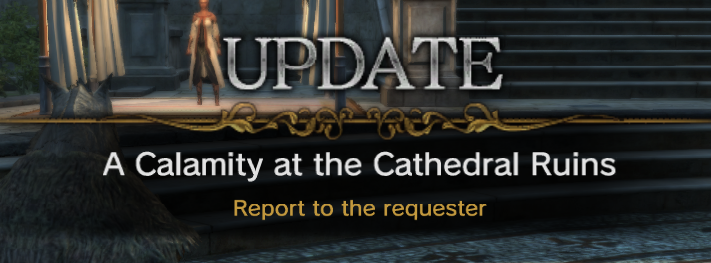
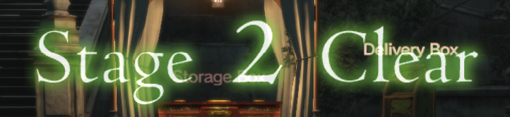

# Quest Command Reference

The quest commands are the commands used by the quest state machine in the client. As far as we can tell, the result commands are always executed first. Then the check commands are what control the progress of the state machine to request the next block for the process.


There are certain acronyms used in the command names

| Acronym | Meaning |
|:-------:|:-------:|
| Em      | Enemy   |
| Eq      | Equal   |
| OM      | Object Manager (doors, levers, glowing points) |
| Pl      | Player  |
| Prt     | Party   |
| Qst     | Quest   |
| Sce     | Scenario Bounding box? |

> [!NOTE]
> Some of the commands have misspellings in their names. I left them as originally sourced to help with searching/reverse engineering.

## Check Commands

Check commands are commands which gate the progress/advancement of the current quest block in a process to the next quest block in a process.

### TalkNpc

| Field | Value |
|-------|-------|
| Address | `0x00635020` |
| Table index | 1 (check) |
| Key fields | Looks up NPC by npcId; **returns 0 (blocks) when NPC+0x11 != 0** (i.e. NPC is in order mode) |

```
/**
 * @brief Progresses when the player talks to the specified NPC.
 * Fails immediately if the NPC's order mode flag (NPC+0x11) is set — NPC is reserved for an order interaction.
 * @param stageNo
 * @param npcId
 */
TalkNpc(StageNo stageNo, NpcId npcId, int param03 = 0, int param04 = 0);
```

### DieEnemy
```
/**
 * @brief
 * @param stageNo
 * @param groupNo
 * @param setNo
 */
DieEnemy(StageNo stageNo, int groupNo, int setNo, int param04 = 0);
```

### SceHitIn

```
/**
 * @brief
 * @param stageNo
 * @param sceNo
 */
SceHitIn(StageNo stageNo, int sceNo, int param03 = 0, int param04 = 0);
```

### HaveItem

```
/**
 * @brief
 * @param itemId
 * @param itemNum
 */
HaveItem(int itemId, int itemNum, int param03 = 0, int param04 = 0);
```
### DeliverItem

```
/**
 * @brief
 * @param itemId
 * @param itemNum
 * @param npcId
 * @param msgNo
 */
DeliverItem(int itemId, int itemNum, NpcId npcId = NpcId.None, int msgNo = 0);
```

### EmDieLight

```
/**
 * @brief
 * @param enemyGroupId
 * @param enemyLv
 * @param enemyNum
 */
EmDieLight(int enemyGroupId, int enemyLv, int enemyNum, int param04 = 0);
```

### QstFlagOn

```
/**
 * @brief
 * @param questId
 * @param flagNo
 */
QstFlagOn(int questId, int flagNo, int param03 = 0, int param04 = 0);
```

### QstFlagOff

```
/**
 * @brief
 * @param questId
 * @param flagNo
 */
QstFlagOff(int questId, int flagNo, int param03 = 0, int param04 = 0);
```

### MyQstFlagOn

```
/**
 * @brief
 * @param flagNo
 */
MyQstFlagOn(int flagNo, int param02 = 0, int param03 = 0, int param04 = 0);
```

### MyQstFlagOff

```
/**
 * @brief
 * @param flagNo
 */
MyQstFlagOff(int flagNo, int param02 = 0, int param03 = 0, int param04 = 0);
```

### Padding00
```
/**
 * @brief
 */
Padding00(int param01 = 0, int param02 = 0, int param03 = 0, int param04 = 0);
```

### Padding01
```
/**
 * @brief
 */
Padding01(int param01 = 0, int param02 = 0, int param03 = 0, int param04 = 0);
```

### Padding02
```
/**
 * @brief
 */
Padding02(int param01 = 0, int param02 = 0, int param03 = 0, int param04 = 0);
```

### StageNo

```
/**
 * @brief
 * @param stageNo
 */
StageNo(StageNo stageNo, int param02 = 0, int param03 = 0, int param04 = 0);
```

### EventEnd

```
/**
 * @brief
 * @param stageNo
 * @param eventNo
 */
EventEnd(StageNo stageNo, int eventNo, int param03 = 0, int param04 = 0);
```

### Prt

```
/**
 * @brief Checks to see if all members of the party are ready before proceding.
 * There is an equivalent ResultCommand which spawns this point.
 * @param stageNo
 * @param x
 * @param y
 * @param z
 */
Prt(StageNo stageNo, int x, int y, int z);
```

### Clearcount

```
/**
 * @brief
 * @param minCount
 * @param maxCount
 */
Clearcount(int minCount, int maxCount, int param03 = 0, int param04 = 0);
```

### SceFlagOn

```
/**
 * @brief
 * @param flagNo
 */
SceFlagOn(int flagNo, int param02 = 0, int param03 = 0, int param04 = 0);
```

### SceFlagOff

```
/**
 * @brief
 * @param flagNo
 */
SceFlagOff(int flagNo, int param02 = 0, int param03 = 0, int param04 = 0);
```

### TouchActToNpc

```
/**
 * @brief
 * @param stageNo
 * @param npcId
 */
TouchActToNpc(StageNo stageNo, NpcId npcId, int param03 = 0, int param04 = 0);
```

### OrderDecide

```
/**
 * @brief
 * @param npcId
 */
OrderDecide(NpcId npcId, int param02 = 0, int param03 = 0, int param04 = 0);
```

### IsEndCycle

```
/**
 * @brief
 */
IsEndCycle(int param01 = 0, int param02 = 0, int param03 = 0, int param04 = 0);
```

### IsInterruptCycle

```
/**
 * @brief
 */
IsInterruptCycle(int param01 = 0, int param02 = 0, int param03 = 0, int param04 = 0);
```

### IsFailedCycle

```
/**
 * @brief
 */
IsFailedCycle(int param01 = 0, int param02 = 0, int param03 = 0, int param04 = 0);
```

### IsEndResult

```
/**
 * @brief
 */
IsEndResult(int param01 = 0, int param02 = 0, int param03 = 0, int param04 = 0);
```

### NpcTalkAndOrderUi

| Field | Value |
|-------|-------|
| Address | `0x00636570` |
| Table index | 26 (check) |
| Key fields | Sets NPC+0x11 = 1 (order flag); stores `noOrderGroupSerial` at **NPC object +0xc**; delegates to TalkNpc sub-check; clears NPC+0x11 on success |

```
/**
 * @brief Orders a quest from an NPC with multiple talking options.
 * Sets the NPC's order mode flag (NPC+0x11 = 1), stores noOrderGroupSerial on the NPC object (+0xc)
 * for the UI to select the right dialog group, then gates on TalkNpc (player must physically talk).
 * On success: clears NPC+0x11 = 0 and calls the order-confirm function.
 * @param stageNo
 * @param npcId
 * @param noOrderGroupSerial  Stored at NPC+0xc; selects which dialog group to present.
 */
NpcTalkAndOrderUi(StageNo stageNo, NpcId npcId, int noOrderGroupSerial, int param04 = 0);
```

### NpcTouchAndOrderUi

| Field | Value |
|-------|-------|
| Address | `0x00636660` |
| Table index | 27 (check) |

```
/**
 * @brief Orders a quest from an NPC with no talking options after order (touch/proximity only).
 * Sets TalkData to (npcId, noOrderGroupSerial) and plays dialogue when the quest is not ordered.
 * @param stageNo
 * @param npcId
 * @param noOrderGroupSerial
 */
NpcTouchAndOrderUi(StageNo stageNo, NpcId npcId, int noOrderGroupSerial, int param04 = 0);
```

### StageNoNotEq

```
/**
 * @brief
 * @param stageNo
 */
StageNoNotEq(StageNo stageNo, int param02 = 0, int param03 = 0, int param04 = 0);
```

### Warlevel

```
/**
 * @brief
 * @param warLevel
 */
Warlevel(int warLevel, int param02 = 0, int param03 = 0, int param04 = 0);
```

### TalkNpcWithoutMarker

```
/**
 * @brief
 * @param stageNo
 * @param npcId
 */
TalkNpcWithoutMarker(StageNo stageNo, NpcId npcId, int param03 = 0, int param04 = 0);
```

### HaveMoney

```
/**
 * @brief
 * @param gold
 * @param type
 */
HaveMoney(int gold, int type, int param03 = 0, int param04 = 0);
```

### SetQuestClearNum

```
/**
 * @brief Waits until the player has cleared at least one world quest ("Set Quest") in the given area.
 *        Client handler: 0x00636B30
 *
 * @note "Set Quest" is the internal engine name; "World Quest" is the English localisation.
 *
 * @param clearNum  The required clear count. NOTE: NEVER READ by the client handler — the client
 *                  only checks whether areaId appears in a 4-slot cleared-area byte array at
 *                  ctx+0x5c+0x25a. The count is advisory for the server-side work item only.
 * @param areaId    The QuestAreaId to check. Scanned against up to 4 stored area-ID bytes.
 *
 * @note The check also requires bit 5 of ctx+0x5c+0x208 to be set. This bit and the area-ID
 *       slot are written by the S2CQuestQuestProgressWorkSaveNtc carrying
 *       QuestNotifyCommand.SetQuestClearNum (notify ID 32). The server sends this NTC either:
 *         (a) When a world quest in the target area completes (WorldQuestClearedProgressWork), or
 *         (b) Immediately at block dispatch time if a matching world quest was already cleared
 *             (HandlePreSatisfiedWorldQuestWork in QuestQuestProgressHandler).
 */
SetQuestClearNum(int clearNum, int areaId, int param03 = 0, int param04 = 0);
```

### MakeCraft

```
/**
 * @brief
 */
MakeCraft(int param01 = 0, int param02 = 0, int param03 = 0, int param04 = 0);
```

### PlayEmotion

```
/**
 * @brief
 */
PlayEmotion(int param01 = 0, int param02 = 0, int param03 = 0, int param04 = 0);
```

### IsEndTimer

| Field | Value |
|-------|-------|
| Address | `0x00636BF0` |
| Table index | 35 (check) |
| Key callees | `FUN_0064d130(timerNo)` — Timer List A lookup at ctx+0xf0/0xfc; returns `entry+8` |

```
/**
 * @brief Returns true when a quest instance timer (Timer List A) has expired.
 * Walks the timer list keyed by timerNo; returns entry+8 == 0.
 * Returns false (-1 sentinel) if timerNo is not registered.
 * @note Pair with StartTimer(timerNo, sec). Server must schedule a QuestProgressNtc
 *       to fire at expiry so the client re-evaluates this check.
 * @param timerNo Timer slot identifier (set by StartTimer)
 */
IsEndTimer(int timerNo, int param02 = 0, int param03 = 0, int param04 = 0);
```

### IsEnemyFound

```
/**
 * @brief
 * @param stageNo
 * @param groupNo
 * @param setNo
 */
IsEnemyFound(StageNo stageNo, int groupNo, int setNo, int param04 = 0);
```

### RandomEq

```
/**
 * @brief Returns true if the value stored in random slot randomNo equals value.
 *        Slot must have been set by SetRandom first; returns false if unset.
 *        Ghidra: 0x00636F60. param03/param04 unused.
 * @param randomNo  Index of the random slot (0-based).
 * @param value     Value to compare against.
 */
RandomEq(int randomNo, int value, int param03 = 0, int param04 = 0);
```

### RandomNotEq

```
/**
 * @brief Returns true if the value stored in random slot randomNo does not equal value.
 *        Ghidra: 0x00637030. param03/param04 unused.
 * @param randomNo  Index of the random slot (0-based).
 * @param value     Value to compare against.
 */
RandomNotEq(int randomNo, int value, int param03 = 0, int param04 = 0);
```

### RandomLess

```
/**
 * @brief Returns true if the value stored in random slot randomNo is less than value.
 *        Ghidra: 0x00637100. param03/param04 unused.
 * @param randomNo  Index of the random slot (0-based).
 * @param value     Value to compare against.
 */
RandomLess(int randomNo, int value, int param03 = 0, int param04 = 0);
```

### RandomNotGreater

```
/**
 * @brief Returns true if the value stored in random slot randomNo is less than or equal to value.
 *        Ghidra: 0x006371D0. param03/param04 unused.
 * @param randomNo  Index of the random slot (0-based).
 * @param value     Value to compare against.
 */
RandomNotGreater(int randomNo, int value, int param03 = 0, int param04 = 0);
```

### RandomGreater

```
/**
 * @brief Returns true if the value stored in random slot randomNo is greater than value.
 *        Ghidra: 0x006372A0. param03/param04 unused.
 * @param randomNo  Index of the random slot (0-based).
 * @param value     Value to compare against.
 */
RandomGreater(int randomNo, int value, int param03 = 0, int param04 = 0);
```

### RandomNotLess

```
/**
 * @brief Returns true if the value stored in random slot randomNo is greater than or equal to value.
 *        Ghidra: 0x00637370. param03/param04 unused.
 * @param randomNo  Index of the random slot (0-based).
 * @param value     Value to compare against.
 */
RandomNotLess(int randomNo, int value, int param03 = 0, int param04 = 0);
```

### Clearcount02

```
/**
 * @brief
 * @param div
 * @param value
 */
Clearcount02(int div, int value, int param03 = 0, int param04 = 0);
```

### IngameTimeRangeEq

```
/**
 * @brief
 * @param minTime
 * @param maxTime
 */
IngameTimeRangeEq(int minTime, int maxTime, int param03 = 0, int param04 = 0);
```

### IngameTimeRangeNotEq

```
/**
 * @brief
 * @param minTime
 * @param maxTime
 */
IngameTimeRangeNotEq(int minTime, int maxTime, int param03 = 0, int param04 = 0);
```

### PlHp

```
/**
 * @brief
 * @param hpRate
 * @param type
 */
PlHp(int hpRate, int type, int param03 = 0, int param04 = 0);
```

### EmHpNotLess

```
/**
 * @brief
 * @param stageNo
 * @param groupNo
 * @param setNo
 * @param hpRate
 */
EmHpNotLess(StageNo stageNo, int groupNo, int setNo, int hpRate);
```

### EmHpLess

```
/**
 * @brief
 * @param stageNo
 * @param groupNo
 * @param setNo
 * @param hpRate
 */
EmHpLess(StageNo stageNo, int groupNo, int setNo, int hpRate);
```

### WeatherEq

```
/**
 * @brief
 * @param weatherId
 */
WeatherEq(int weatherId, int param02 = 0, int param03 = 0, int param04 = 0);
```

### WeatherNotEq

```
/**
 * @brief
 * @param weatherId
 */
WeatherNotEq(int weatherId, int param02 = 0, int param03 = 0, int param04 = 0);
```

### PlJobEq

```
/**
 * @brief
 * @param jobId
 */
PlJobEq(int jobId, int param02 = 0, int param03 = 0, int param04 = 0);
```

### PlJobNotEq

```
/**
 * @brief
 * @param jobId
 */
PlJobNotEq(int jobId, int param02 = 0, int param03 = 0, int param04 = 0);
```

### PlSexEq

```
/**
 * @brief
 * @param sex
 */
PlSexEq(int sex, int param02 = 0, int param03 = 0, int param04 = 0);
```

### PlSexNotEq

```
/**
 * @brief
 * @param sex
 */
PlSexNotEq(int sex, int param02 = 0, int param03 = 0, int param04 = 0);
```

### SceHitOut

```
/**
 * @brief
 * @param stageNo
 * @param sceNo
 */
SceHitOut(StageNo stageNo, int sceNo, int param03 = 0, int param04 = 0);
```

### WaitOrder

```
/**
 * @brief
 */
WaitOrder(int param01 = 0, int param02 = 0, int param03 = 0, int param04 = 0);
```

### OmSetTouch

```
/**
 * @brief Used to touch objects spawned by World Manage Quests.
 * @param stageNo
 * @param groupNo
 * @param setNo
 */
OmSetTouch(StageNo stageNo, int groupNo, int setNo, int param04 = 0);
```

### OmReleaseTouch

```
/**
 * @brief Used to detect released objects spawned by World Manage Quests.
 * @param stageNo
 * @param groupNo
 * @param setNo
 */
OmReleaseTouch(StageNo stageNo, int groupNo, int setNo, int param04 = 0);
```

### JobLevelNotLess

```
/**
 * @brief
 * @param checkType
 * @param level
 */
JobLevelNotLess(int checkType, int level, int param03 = 0, int param04 = 0);
```

### JobLevelLess

```
/**
 * @brief
 * @param checkType
 * @param level
 */
JobLevelLess(int checkType, int level, int param03 = 0, int param04 = 0);
```

### MyQstFlagOnFromFsm

```
/**
 * @brief Checks for flags set by the NPC FSM. These flags would be the "FlagNo" values
 * under the "MainQstFlagOn" container name inside the npc fsm JSON files.
 * @param flagNo
 */
MyQstFlagOnFromFsm(int flagNo, int param02 = 0, int param03 = 0, int param04 = 0);
```

### SceHitInWithoutMarker

```
/**
 * @brief
 * @param stageNo
 * @param sceNo
 */
SceHitInWithoutMarker(StageNo stageNo, int sceNo, int param03 = 0, int param04 = 0);
```

### SceHitOutWithoutMarker

```
/**
 * @brief
 * @param stageNo
 * @param sceNo
 */
SceHitOutWithoutMarker(StageNo stageNo, int sceNo, int param03 = 0, int param04 = 0);
```

### KeyItemPoint

```
/**
 * @brief
 * @param idx
 * @param num
 */
KeyItemPoint(int idx, int num, int param03 = 0, int param04 = 0);
```

### IsNotEndTimer

| Field | Value |
|-------|-------|
| Address | `0x00638520` |
| Table index | 65 (check) |
| Key callees | `FUN_0064d130(timerNo)` — Timer List A lookup; returns `entry+8` |

```
/**
 * @brief Returns true while a quest instance timer (Timer List A) is still running.
 * Walks the timer list keyed by timerNo; returns 1 if entry+8 != 0 AND entry+8 != -1.
 * Returns false if the timer has expired (entry+8==0) or is not registered (-1 sentinel).
 * @note Logical inverse of IsEndTimer, but with an additional -1 guard.
 * @param timerNo Timer slot identifier (set by StartTimer)
 */
IsNotEndTimer(int timerNo, int param02 = 0, int param03 = 0, int param04 = 0);
```

### IsMainQuestClear

```
/**
 * @brief
 * @param questId
 */
IsMainQuestClear(int questId, int param02 = 0, int param03 = 0, int param04 = 0);
```

### DogmaOrb

```
/**
 * @brief Check is satisfied when player buys blood orb upgrade from the white dragon.
 */
DogmaOrb(int param01 = 0, int param02 = 0, int param03 = 0, int param04 = 0);
```

### IsEnemyFoundForOrder

```
/**
 * @brief
 * @param stageNo
 * @param groupNo
 * @param setNo
 */
IsEnemyFoundForOrder(StageNo stageNo, int groupNo, int setNo, int param04 = 0);
```

### IsTutorialFlagOn

```
/**
 * @brief
 * @param flagNo
 */
IsTutorialFlagOn(int flagNo, int param02 = 0, int param03 = 0, int param04 = 0);
```

### QuestOmSetTouch

```
/**
 * @brief
 * @param stageNo
 * @param groupNo
 * @param setNo
 */
QuestOmSetTouch(StageNo stageNo, int groupNo, int setNo, int param04 = 0);
```

### QuestOmReleaseTouch

```
/**
 * @brief
 * @param stageNo
 * @param groupNo
 * @param setNo
 */
QuestOmReleaseTouch(StageNo stageNo, int groupNo, int setNo, int param04 = 0);
```

### NewTalkNpc

```
/**
 * @brief
 * @param stageNo
 * @param groupNo
 * @param setNo
 * @param questId
 */
NewTalkNpc(StageNo stageNo, int groupNo, int setNo, int questId);
```

### NewTalkNpcWithoutMarker

```
/**
 * @brief
 * @param stageNo
 * @param groupNo
 * @param setNo
 * @param questId
 */
NewTalkNpcWithoutMarker(StageNo stageNo, int groupNo, int setNo, int questId);
```

### IsTutorialQuestClear

```
/**
 * @brief
 * @param questId
 */
IsTutorialQuestClear(int questId, int param02 = 0, int param03 = 0, int param04 = 0);
```

### IsMainQuestOrder

```
/**
 * @brief
 * @param questId
 */
IsMainQuestOrder(int questId, int param02 = 0, int param03 = 0, int param04 = 0);
```

### IsTutorialQuestOrder

```
/**
 * @brief
 * @param questId
 */
IsTutorialQuestOrder(int questId, int param02 = 0, int param03 = 0, int param04 = 0);
```

### IsTouchPawnDungeonOm

```
/**
 * @brief
 * @param stageNo
 * @param groupNo
 * @param setNo
 */
IsTouchPawnDungeonOm(StageNo stageNo, int groupNo, int setNo, int param04 = 0);
```

### IsOpenDoorOmQuestSet

```
/**
 * @brief
 * @param stageNo
 * @param groupNo
 * @param setNo
 * @param questId
 */
IsOpenDoorOmQuestSet(StageNo stageNo, int groupNo, int setNo, int questId);
```

### EmDieForRandomDungeon

```
/**
 * @brief
 * @param stageNo
 * @param enemyId
 * @param enemyNum
 */
EmDieForRandomDungeon(StageNo stageNo, int enemyId, int enemyNum, int param04 = 0);
```

### NpcHpNotLess

```
/**
 * @brief
 * @param stageNo
 * @param groupNo
 * @param setNo
 * @param hpRate
 */
NpcHpNotLess(StageNo stageNo, int groupNo, int setNo, int hpRate);
```

### NpcHpLess

```
/**
 * @brief
 * @param stageNo
 * @param groupNo
 * @param setNo
 * @param hpRate
 */
NpcHpLess(StageNo stageNo, int groupNo, int setNo, int hpRate);
```

### IsEnemyFoundWithoutMarker

```
/**
 * @brief
 * @param stageNo
 * @param groupNo
 * @param setNo
 */
IsEnemyFoundWithoutMarker(StageNo stageNo, int groupNo, int setNo, int param04 = 0);
```

### IsEventBoardAccepted

```
/**
 * @brief
 */
IsEventBoardAccepted(int param01 = 0, int param02 = 0, int param03 = 0, int param04 = 0);
```

### WorldManageQuestFlagOn

```
/**
 * @brief
 * @param flagNo
 * @param questId
 */
WorldManageQuestFlagOn(int flagNo, int questId, int param03 = 0, int param04 = 0);
```

### WorldManageQuestFlagOff

```
/**
 * @brief
 * @param flagNo
 * @param questId
 */
WorldManageQuestFlagOff(int flagNo, int questId, int param03 = 0, int param04 = 0);
```

### TouchEventBoard

```
/**
 * @brief
 */
TouchEventBoard(int param01 = 0, int param02 = 0, int param03 = 0, int param04 = 0);
```

### OpenEntryRaidBoss

```
/**
 * @brief
 */
OpenEntryRaidBoss(int param01 = 0, int param02 = 0, int param03 = 0, int param04 = 0);
```

### OepnEntryFortDefense

```
/**
 * @brief
 */
OepnEntryFortDefense(int param01 = 0, int param02 = 0, int param03 = 0, int param04 = 0);
```

### DiePlayer

```
/**
 * @brief
 */
DiePlayer(int param01 = 0, int param02 = 0, int param03 = 0, int param04 = 0);
```

### PartyNumNotLessWtihoutPawn

```
/**
 * @brief
 * @param partyMemberNum
 */
PartyNumNotLessWtihoutPawn(int partyMemberNum, int param02 = 0, int param03 = 0, int param04 = 0);
```

### PartyNumNotLessWithPawn

```
/**
 * @brief
 * @param partyMemberNum
 */
PartyNumNotLessWithPawn(int partyMemberNum, int param02 = 0, int param03 = 0, int param04 = 0);
```

### LostMainPawn

```
/**
 * @brief
 */
LostMainPawn(int param01 = 0, int param02 = 0, int param03 = 0, int param04 = 0);
```

### SpTalkNpc

```
/**
 * @brief
 */
SpTalkNpc(int param01 = 0, int param02 = 0, int param03 = 0, int param04 = 0);
```

### OepnJobMaster

```
/**
 * @brief
 */
OepnJobMaster(int param01 = 0, int param02 = 0, int param03 = 0, int param04 = 0);
```

### TouchRimStone

```
/**
 * @brief
 */
TouchRimStone(int param01 = 0, int param02 = 0, int param03 = 0, int param04 = 0);
```

### GetAchievement

```
/**
 * @brief
 */
GetAchievement(int param01 = 0, int param02 = 0, int param03 = 0, int param04 = 0);
```

### DummyNotProgress

```
/**
 * @brief
 */
DummyNotProgress(int param01 = 0, int param02 = 0, int param03 = 0, int param04 = 0);
```

### DieRaidBoss

```
/**
 * @brief
 */
DieRaidBoss(int param01 = 0, int param02 = 0, int param03 = 0, int param04 = 0);
```

### CycleTimerZero

| Field | Value |
|-------|-------|
| Address | `0x00639CD0` |
| Table index | 99 (check) |
| Key callees | `FUN_00be2460(this)` — reads byte flag at `this+0x649` |

```
/**
 * @brief Returns the cycle timer "reached zero" flag byte from the world quest manager.
 * Reads a byte at cWorldQuestManager+0x649. Non-zero means the cycle timer hit zero.
 * @note All params unused. Server evaluates from its own WorldQuestManager state.
 */
CycleTimerZero(int param01 = 0, int param02 = 0, int param03 = 0, int param04 = 0);
```

### CycleTimer

| Field | Value |
|-------|-------|
| Address | `0x00639D20` |
| Table index | 100 (check) |
| Key callees | `FUN_00bdbbf0(this)` — returns remaining cycle time as float (`deadline - current` via `this+0x1d0`) |

```
/**
 * @brief Returns true if the world quest cycle timer has at least timeSec seconds remaining.
 * Computes remaining = deadline - current from the cycle timer object at this+0x1d0.
 * Returns timeSec <= remaining.
 * @note Server evaluates by reading WorldQuestManager's cycle timer state.
 * @param timeSec Minimum seconds required to still be remaining
 */
CycleTimer(int timeSec, int param02 = 0, int param03 = 0, int param04 = 0);
```

### QuestNpcTalkAndOrderUi
```
/**
 * @brief
 * @param stageNo
 * @param groupNo
 * @param setNo
 * @param questId
 */
QuestNpcTalkAndOrderUi(StageNo stageNo, int groupNo, int setNo, int questId);
```

### QuestNpcTouchAndOrderUi
```
/**
 * @brief
 * @param stageNo
 * @param groupNo
 * @param setNo
 * @param questId
 */
QuestNpcTouchAndOrderUi(StageNo stageNo, int groupNo, int setNo, int questId);
```

### IsFoundRaidBoss
```
/**
 * @brief
 * @param stageNo
 * @param groupNo
 * @param setNo
 * @param enemyId
 */
IsFoundRaidBoss(StageNo stageNo, int groupNo, int setNo, int enemyId);
```

### QuestOmSetTouchWithoutMarker
```
/**
 * @brief
 * @param stageNo
 * @param groupNo
 * @param setNo
 */
QuestOmSetTouchWithoutMarker(StageNo stageNo, int groupNo, int setNo, int param04 = 0);
```

### QuestOmReleaseTouchWithoutMarker
```
/**
 * @brief
 * @param stageNo
 * @param groupNo
 * @param setNo
 */
QuestOmReleaseTouchWithoutMarker(StageNo stageNo, int groupNo, int setNo, int param04 = 0);
```

### TutorialTalkNpc
```
/**
 * @brief
 * @param stageNo
 * @param npcId
 */
TutorialTalkNpc(StageNo stageNo, NpcId npcId, int param03 = 0, int param04 = 0);
```

### IsLogin
```
/**
 * @brief
 */
IsLogin(int param01 = 0, int param02 = 0, int param03 = 0, int param04 = 0);
```

### IsPlayEndFirstSeasonEndCredit
```
/**
 * @brief
 */
IsPlayEndFirstSeasonEndCredit(int param01 = 0, int param02 = 0, int param03 = 0, int param04 = 0);
```

### IsKilledTargetEnemySetGroup
```
/**
 * @brief
 * @param flagNo
 */
IsKilledTargetEnemySetGroup(int flagNo, int param02 = 0, int param03 = 0, int param04 = 0);
```

### IsKilledTargetEmSetGrpNoMarker

```
/**
 * @brief
 * @param flagNo
 */
IsKilledTargetEmSetGrpNoMarker(int flagNo, int param02 = 0, int param03 = 0, int param04 = 0);
```

### IsLeftCycleTimer

| Field | Value |
|-------|-------|
| Address | `0x0063A6C0` |
| Table index | 111 (check) |
| Key callees | `FUN_00be1440(this)` — is timer running; `FUN_00bdc580()` — get elapsed time |

```
/**
 * @brief Returns true if the cycle timer elapsed time is between a lower bound and timeSec.
 * Guards on FUN_00be1440 (timer active check). Then: lowerBound <= elapsed <= timeSec.
 * Used as a warning threshold: "the cycle is within timeSec seconds of completion."
 * @note Server evaluates from WorldQuestManager elapsed state.
 * @param timeSec Upper bound on elapsed seconds (warning threshold)
 */
IsLeftCycleTimer(int timeSec, int param02 = 0, int param03 = 0, int param04 = 0);
```

### OmEndText
```
/**
 * @brief
 * @param stageNo
 * @param groupNo
 * @param setNo
 */
OmEndText(StageNo stageNo, int groupNo, int setNo, int param04 = 0);
```

### QuestOmEndText
```
/**
 * @brief
 * @param stageNo
 * @param groupNo
 * @param setNo
 */
QuestOmEndText(StageNo stageNo, int groupNo, int setNo, int param04 = 0);
```

### OpenAreaMaster
```
/**
 * @brief
 * @param areaId
 */
OpenAreaMaster(int areaId, int param02 = 0, int param03 = 0, int param04 = 0);
```

### HaveItemAllBag
```
/**
 * @brief
 * @param itemId
 * @param itemNum
 */
HaveItemAllBag(int itemId, int itemNum, int param03 = 0, int param04 = 0);
```

### OpenNewspaper
```
/**
 * @brief
 */
OpenNewspaper(int param01 = 0, int param02 = 0, int param03 = 0, int param04 = 0);
```

### OpenQuestBoard
```
/**
 * @brief
 */
OpenQuestBoard(int param01 = 0, int param02 = 0, int param03 = 0, int param04 = 0);
```

### StageNoWithoutMarker
```
/**
 * @brief
 * @param stageNo
 */
StageNoWithoutMarker(StageNo stageNo, int param02 = 0, int param03 = 0, int param04 = 0);
```

### TalkQuestNpcUnitMarker
```
/**
 * @brief Used when a NPC walks between multiple points. The marker will continue to float over the NPCs head.
 * @param stageNo
 * @param groupNo
 * @param setNo
 * @param questId
 */
TalkQuestNpcUnitMarker(StageNo stageNo, int groupNo, int setNo, int questId);
```

### TouchQuestNpcUnitMarker
```
/**
 * @brief
 * @param stageNo
 * @param groupNo
 * @param setNo
 * @param questId
 */
TouchQuestNpcUnitMarker(StageNo stageNo, int groupNo, int setNo, int questId);
```

### IsExistSecondPawn
```
/**
 * @brief
 */
IsExistSecondPawn(int param01 = 0, int param02 = 0, int param03 = 0, int param04 = 0);
```

### IsOrderJobTutorialQuest
```
/**
 * @brief
 */
IsOrderJobTutorialQuest(int param01 = 0, int param02 = 0, int param03 = 0, int param04 = 0);
```

### IsOpenWarehouse
```
/**
 * @brief
 */
IsOpenWarehouse(int param01 = 0, int param02 = 0, int param03 = 0, int param04 = 0);
```

### IsMyquestLayoutFlagOn
```
/**
 * @brief
 * @param FlagNo
 */
IsMyquestLayoutFlagOn(int FlagNo, int param02 = 0, int param03 = 0, int param04 = 0);
```

### IsMyquestLayoutFlagOff
```
/**
 * @brief
 * @param FlagNo
 */
IsMyquestLayoutFlagOff(int FlagNo, int param02 = 0, int param03 = 0, int param04 = 0);
```

### IsOpenWarehouseReward
```
/**
 * @brief
 */
IsOpenWarehouseReward(int param01 = 0, int param02 = 0, int param03 = 0, int param04 = 0);
```

### IsOrderLightQuest
```
/**
 * @brief
 */
IsOrderLightQuest(int param01 = 0, int param02 = 0, int param03 = 0, int param04 = 0);
```

### IsOrderWorldQuest
```
/**
 * @brief
 */
IsOrderWorldQuest(int param01 = 0, int param02 = 0, int param03 = 0, int param04 = 0);
```

### IsLostMainPawn
```
/**
 * @brief
 */
IsLostMainPawn(int param01 = 0, int param02 = 0, int param03 = 0, int param04 = 0);
```

### IsFullOrderQuest
```
/**
 * @brief
 */
IsFullOrderQuest(int param01 = 0, int param02 = 0, int param03 = 0, int param04 = 0);
```

### IsBadStatus
```
/**
 * @brief
 */
IsBadStatus(int param01 = 0, int param02 = 0, int param03 = 0, int param04 = 0);
```

### CheckAreaRank
```
/**
 * @brief
 * @param AreaId
 * @param AreaRank
 */
CheckAreaRank(int AreaId, int AreaRank, int param03 = 0, int param04 = 0);
```

### Padding133
```
/**
 * @brief
 */
Padding133(int param01 = 0, int param02 = 0, int param03 = 0, int param04 = 0);
```

### EnablePartyWarp
```
/**
 * @brief
 */
EnablePartyWarp(int param01 = 0, int param02 = 0, int param03 = 0, int param04 = 0);
```

### IsHugeble
```
/**
 * @brief
 */
IsHugeble(int param01 = 0, int param02 = 0, int param03 = 0, int param04 = 0);
```

### IsDownEnemy
```
/**
 * @brief
 */
IsDownEnemy(int param01 = 0, int param02 = 0, int param03 = 0, int param04 = 0);
```

### OpenAreaMasterSupplies
```
/**
 * @brief
 */
OpenAreaMasterSupplies(int param01 = 0, int param02 = 0, int param03 = 0, int param04 = 0);
```

### OpenEntryBoard
```
/**
 * @brief
 */
OpenEntryBoard(int param01 = 0, int param02 = 0, int param03 = 0, int param04 = 0);
```

### NoticeInterruptContents
```
/**
 * @brief
 */
NoticeInterruptContents(int param01 = 0, int param02 = 0, int param03 = 0, int param04 = 0);
```

### OpenRetrySelect
```
/**
 * @brief
 */
OpenRetrySelect(int param01 = 0, int param02 = 0, int param03 = 0, int param04 = 0);
```

### IsPlWeakening
```
/**
 * @brief
 */
IsPlWeakening(int param01 = 0, int param02 = 0, int param03 = 0, int param04 = 0);
```

### NoticePartyInvite
```
/**
 * @brief
 */
NoticePartyInvite(int param01 = 0, int param02 = 0, int param03 = 0, int param04 = 0);
```

### IsKilledAreaBoss
```
/**
 * @brief
 */
IsKilledAreaBoss(int param01 = 0, int param02 = 0, int param03 = 0, int param04 = 0);
```

### IsPartyReward
```
/**
 * @brief
 */
IsPartyReward(int param01 = 0, int param02 = 0, int param03 = 0, int param04 = 0);
```

### IsFullBag
```
/**
 * @brief
 */
IsFullBag(int param01 = 0, int param02 = 0, int param03 = 0, int param04 = 0);
```

### OpenCraftExam
```
/**
 * @brief
 */
OpenCraftExam(int param01 = 0, int param02 = 0, int param03 = 0, int param04 = 0);
```

### LevelUpCraft
```
/**
 * @brief
 */
LevelUpCraft(int param01 = 0, int param02 = 0, int param03 = 0, int param04 = 0);
```

### IsClearLightQuest
```
/**
 * @brief
 */
IsClearLightQuest(int param01 = 0, int param02 = 0, int param03 = 0, int param04 = 0);
```

### OpenJobMasterReward
```
/**
 * @brief
 */
OpenJobMasterReward(int param01 = 0, int param02 = 0, int param03 = 0, int param04 = 0);
```

### TouchActQuestNpc
```
/**
 * @brief
 * @param stageNo
 * @param groupNo
 * @param setNo
 * @param questId
 */
TouchActQuestNpc(StageNo stageNo, int groupNo, int setNo, int questId);
```

### IsLeaderAndJoinPawn
```
/**
 * @brief
 * @param pawnNum
 */
IsLeaderAndJoinPawn(int pawnNum, int param02 = 0, int param03 = 0, int param04 = 0);
```

### IsAcceptLightQuest
```
/**
 * @brief
 */
IsAcceptLightQuest(int param01 = 0, int param02 = 0, int param03 = 0, int param04 = 0);
```

### IsReleaseWarpPoint
```
/**
 * @brief
 */
IsReleaseWarpPoint(int param01 = 0, int param02 = 0, int param03 = 0, int param04 = 0);
```

### IsSetPlayerSkill
```
/**
 * @brief
 */
IsSetPlayerSkill(int param01 = 0, int param02 = 0, int param03 = 0, int param04 = 0);
```

### IsOrderMyQuest
```
/**
 * @brief
 */
IsOrderMyQuest(int param01 = 0, int param02 = 0, int param03 = 0, int param04 = 0);
```

### IsNotOrderMyQuest
```
/**
 * @brief
 */
IsNotOrderMyQuest(int param01 = 0, int param02 = 0, int param03 = 0, int param04 = 0);
```

### HasMypawn
```
/**
 * @brief
 */
HasMypawn(int param01 = 0, int param02 = 0, int param03 = 0, int param04 = 0);
```

### IsFavoriteWarpPoint
```
/**
 * @brief
 * @param warpPointId
 */
IsFavoriteWarpPoint(int warpPointId, int param02 = 0, int param03 = 0, int param04 = 0);
```

### Craft
```
/**
 * @brief
 */
Craft(int param01 = 0, int param02 = 0, int param03 = 0, int param04 = 0);
```

### IsKilledTargetEnemySetGroupGmMain
```
/**
 * @brief
 * @param flagNo
 */
IsKilledTargetEnemySetGroupGmMain(int flagNo, int param02 = 0, int param03 = 0, int param04 = 0);
```

### IsKilledTargetEnemySetGroupGmSub
```
/**
 * @brief
 * @param flagNo
 */
IsKilledTargetEnemySetGroupGmSub(int flagNo, int param02 = 0, int param03 = 0, int param04 = 0);
```

### HasUsedKey
```
/**
 * @brief
 * @param stageNo
 * @param groupNo
 * @param setNo
 * @param questId
 */
HasUsedKey(StageNo stageNo, int groupNo, int setNo, int questId);
```

### IsCycleFlagOffPeriod
```
/**
 * @brief
 */
IsCycleFlagOffPeriod(int param01 = 0, int param02 = 0, int param03 = 0, int param04 = 0);
```

### IsEnemyFoundGmMain
```
/**
 * @brief
 * @param stageNo
 * @param groupNo
 * @param setNo
 */
IsEnemyFoundGmMain(StageNo stageNo, int groupNo, int setNo, int param04 = 0);
```

### IsEnemyFoundGmSub
```
/**
 * @brief
 * @param stageNo
 * @param groupNo
 * @param setNo
 */
IsEnemyFoundGmSub(StageNo stageNo, int groupNo, int setNo, int param04 = 0);
```

### IsLoginBugFixedOnly
```
/**
 * @brief
 */
IsLoginBugFixedOnly(int param01 = 0, int param02 = 0, int param03 = 0, int param04 = 0);
```

### IsSearchClan
```
/**
 * @brief
 */
IsSearchClan(int param01 = 0, int param02 = 0, int param03 = 0, int param04 = 0);
```

### IsOpenAreaListUi
```
/**
 * @brief
 */
IsOpenAreaListUi(int param01 = 0, int param02 = 0, int param03 = 0, int param04 = 0);
```

### IsReleaseWarpPointAnyone
```
/**
 * @brief
 * @param warpPointId
 */
IsReleaseWarpPointAnyone(int warpPointId, int param02 = 0, int param03 = 0, int param04 = 0);
```

### DevidePlayer
```
/**
 * @brief
 */
DevidePlayer(int param01 = 0, int param02 = 0, int param03 = 0, int param04 = 0);
```

### NowPhase
```
/**
 * @brief
 * @param phaseId
 */
NowPhase(int phaseId, int param02 = 0, int param03 = 0, int param04 = 0);
```

### IsReleasePortal
```
/**
 * @brief
 */
IsReleasePortal(int param01 = 0, int param02 = 0, int param03 = 0, int param04 = 0);
```

### IsGetAppraiseItem
```
/**
 * @brief
 */
IsGetAppraiseItem(int param01 = 0, int param02 = 0, int param03 = 0, int param04 = 0);
```

### IsSetPartnerPawn
```
/**
 * @brief
 */
IsSetPartnerPawn(int param01 = 0, int param02 = 0, int param03 = 0, int param04 = 0);
```

### IsPresentPartnerPawn
```
/**
 * @brief
 */
IsPresentPartnerPawn(int param01 = 0, int param02 = 0, int param03 = 0, int param04 = 0);
```

### IsReleaseMyRoom
```
/**
 * @brief
 */
IsReleaseMyRoom(int param01 = 0, int param02 = 0, int param03 = 0, int param04 = 0);
```

### IsExistDividePlayer
```
/**
 * @brief
 */
IsExistDividePlayer(int param01 = 0, int param02 = 0, int param03 = 0, int param04 = 0);
```

### NotDividePlayer
```
/**
 * @brief
 */
NotDividePlayer(int param01 = 0, int param02 = 0, int param03 = 0, int param04 = 0);
```

### IsGatherPartyInStage
```
/**
 * @brief
 * @param stageNo
 */
IsGatherPartyInStage(StageNo stageNo, int param02 = 0, int param03 = 0, int param04 = 0);
```

### IsFinishedEnemyDivideAction
```
/**
 * @brief
 */
IsFinishedEnemyDivideAction(int param01 = 0, int param02 = 0, int param03 = 0, int param04 = 0);
```

### IsOpenDoorOmQuestSetNoMarker
```
/**
 * @brief
 * @param stageNo
 * @param groupNo
 * @param setNo
 * @param questId
 */
IsOpenDoorOmQuestSetNoMarker(StageNo stageNo, int groupNo, int setNo, int questId);
```

### IsFinishedEventOrderNum
```
/**
 * @brief
 * @param stageNo
 * @param eventNo
 */
IsFinishedEventOrderNum(StageNo stageNo, int eventNo, int param03 = 0, int param04 = 0);
```

### IsPresentPartnerPawnNoMarker
```
/**
 * @brief
 */
IsPresentPartnerPawnNoMarker(int param01 = 0, int param02 = 0, int param03 = 0, int param04 = 0);
```

### IsOmBrokenLayout
```
/**
 * @brief
 * @param stageNo
 * @param groupNo
 * @param setNo
 */
IsOmBrokenLayout(StageNo stageNo, int groupNo, int setNo, int param04 = 0);
```

### IsOmBrokenQuest
```
/**
 * @brief
 * @param stageNo
 * @param groupNo
 * @param setNo
 */
IsOmBrokenQuest(StageNo stageNo, int groupNo, int setNo, int param04 = 0);
```

### IsHoldingPeriodCycleContents
```
/**
 * @brief
 */
IsHoldingPeriodCycleContents(int param01 = 0, int param02 = 0, int param03 = 0, int param04 = 0);
```

### IsNotHoldingPeriodCycleContents
```
/**
 * @brief
 */
IsNotHoldingPeriodCycleContents(int param01 = 0, int param02 = 0, int param03 = 0, int param04 = 0);
```

### IsResetInstanceArea
```
/**
 * @brief
 */
IsResetInstanceArea(int param01 = 0, int param02 = 0, int param03 = 0, int param04 = 0);
```

### CheckMoonAge
```
/**
 * @brief
 * @param moonAgeStart
 * @param moonAgeEnd
 */
CheckMoonAge(int moonAgeStart, int moonAgeEnd, int param03 = 0, int param04 = 0);
```

### IsOrderPawnQuest
```
/**
 * @brief
 * @param orderGroupSerial
 * @param noOrderGroupSerial
 */
IsOrderPawnQuest(int orderGroupSerial, int noOrderGroupSerial, int param03 = 0, int param04 = 0);
```

### IsTakePictures
```
/**
 * @brief
 */
IsTakePictures(int param01 = 0, int param02 = 0, int param03 = 0, int param04 = 0);
```

### IsStageForMainQuest
```
/**
 * @brief
 * @param stageNo
 */
IsStageForMainQuest(StageNo stageNo, int param02 = 0, int param03 = 0, int param04 = 0);
```

### IsReleasePawnExpedition
```
/**
 * @brief
 */
IsReleasePawnExpedition(int param01 = 0, int param02 = 0, int param03 = 0, int param04 = 0);
```

### OpenPpMode
```
/**
 * @brief
 */
OpenPpMode(int param01 = 0, int param02 = 0, int param03 = 0, int param04 = 0);
```

### PpNotLess
```
/**
 * @brief
 * @param point
 */
PpNotLess(int point, int param02 = 0, int param03 = 0, int param04 = 0);
```

### OpenPpShop
```
/**
 * @brief
 */
OpenPpShop(int param01 = 0, int param02 = 0, int param03 = 0, int param04 = 0);
```

### TouchClanBoard
```
/**
 * @brief
 */
TouchClanBoard(int param01 = 0, int param02 = 0, int param03 = 0, int param04 = 0);
```

### IsOneOffGather
```
/**
 * @brief
 */
IsOneOffGather(int param01 = 0, int param02 = 0, int param03 = 0, int param04 = 0);
```

### IsOmBrokenLayoutNoMarker
```
/**
 * @brief
 * @param stageNo
 * @param groupNo
 * @param setNo
 */
IsOmBrokenLayoutNoMarker(StageNo stageNo, int groupNo, int setNo, int param04 = 0);
```

### IsOmBrokenQuestNoMarker
```
/**
 * @brief
 * @param stageNo
 * @param groupNo
 * @param setNo
 */
IsOmBrokenQuestNoMarker(StageNo stageNo, int groupNo, int setNo, int param04 = 0);
```

### KeyItemPointEq
```
/**
 * @brief
 * @param idx
 * @param num
 */
KeyItemPointEq(int idx, int num, int param03 = 0, int param04 = 0);
```

### IsEmotion
```
/**
 * @brief
 * @param actNo
 */
IsEmotion(int actNo, int param02 = 0, int param03 = 0, int param04 = 0);
```

### IsEquipColor
```
/**
 * @brief
 * @param color
 */
IsEquipColor(int color, int param02 = 0, int param03 = 0, int param04 = 0);
```

### IsEquip
```
/**
 * @brief
 * @param itemId
 */
IsEquip(int itemId, int param02 = 0, int param03 = 0, int param04 = 0);
```

### IsTakePicturesNpc
```
/**
 * @brief
 * @param stageNo
 * @param npcId01
 * @param npcId02
 * @param npcId03
 */
IsTakePicturesNpc(StageNo stageNo, int npcId01, int npcId02, int npcId03);
```

### SayMessage
```
/**
 * @brief
 */
SayMessage(int param01 = 0, int param02 = 0, int param03 = 0, int param04 = 0);
```

### IsTakePicturesWithoutPawn
```
/**
 * @brief
 * @param stageNo
 * @param x
 * @param y
 * @param z
 */
IsTakePicturesWithoutPawn(StageNo stageNo, int x, int y, int z);
```

### IsLinkageEnemyFlag
```
/**
 * @brief
 * @param stageNo
 * @param groupNo
 * @param setNo
 * @param flagNo
 */
IsLinkageEnemyFlag(StageNo stageNo, int groupNo, int setNo, int flagNo);
```

### IsLinkageEnemyFlagOff
```
/**
 * @brief
 * @param stageNo
 * @param groupNo
 * @param setNo
 * @param flagNo
 */
IsLinkageEnemyFlagOff(StageNo stageNo, int groupNo, int setNo, int flagNo);
```

### IsReleaseSecretRoom
```
/**
 * @brief
 */
IsReleaseSecretRoom(int param01 = 0, int param02 = 0, int param03 = 0, int param04 = 0);
```

## Result Commands

### LotOn

```
/**
 * @brief
 * @param stageNo
 * @param lotNo
 */
LotOn(StageNo stageNo, int lotNo, int param03 = 0, int param04 = 0);
```

### LotOff

```
/**
 * @brief
 * @param stageNo
 * @param lotNo
 */
LotOff(StageNo stageNo, int lotNo, int param03 = 0, int param04 = 0);
```

### HandItem

```
/**
 * @brief
 * @param itemId
 * @param itemNum
 */
HandItem(int itemId, int itemNum, int param03 = 0, int param04 = 0);
```

### SetAnnounce

```
/**
 * @brief
 * @param announceType
 * @param announceSubtype Some announce commands like accept use this parameter to distinguish between distinguish between "discovered (0)" and "accept (1)" banner.
 */
SetAnnounce(QuestAnnounceType announceType, int announceSubtype = 0, int param03 = 0, int param04 = 0);
```

### UpdateAnnounce

```
/**
 * @brief
 * @param type
 */
UpdateAnnounce(QuestAnnounceType announceType = QuestAnnounceType.Accept, int param02 = 0, int param03 = 0, int param04 = 0);
```

### ChangeMessage

```
/**
 * @brief
 */
ChangeMessage(int param01 = 0, int param02 = 0, int param03 = 0, int param04 = 0);
```

### QstFlagOn

```
/**
 * @brief
 */
QstFlagOn(int param01 = 0, int param02 = 0, int param03 = 0, int param04 = 0);
```

### MyQstFlagOn

```
/**
 * @brief
 * @param flagNo
 */
MyQstFlagOn(int flagNo, int param02 = 0, int param03 = 0, int param04 = 0);
```

### GlobalFlagOn

```
/**
 * @brief
 */
GlobalFlagOn(int param01 = 0, int param02 = 0, int param03 = 0, int param04 = 0);
```

### QstTalkChg

```
/**
 * @brief
 * @param npcId
 * @param msgNo
 */
QstTalkChg(NpcId npcId, int msgNo, int param03 = 0, int param04 = 0);
```

### QstTalkDel

```
/**
 * @brief
 * @param npcId
 */
QstTalkDel(NpcId npcId, int param02 = 0, int param03 = 0, int param04 = 0);
```

### StageJump

```
/**
 * @brief
 * @param stageNo
 * @param startPos
 */
StageJump(StageNo stageNo, int startPos, int param03 = 0, int param04 = 0);
```

### EventExec

```
/**
 * @brief
 * @param stageNo
 * @param eventNo
 * @param jumpStageNo
 * @param jumpStartPosNo
 */
EventExec(StageNo stageNo, int eventNo, StageNo jumpStageNo, int jumpStartPosNo);
```

### CallMessage

```
/**
 * @brief
 */
CallMessage(int param01 = 0, int param02 = 0, int param03 = 0, int param04 = 0);
```

### Prt

```
/**
 * @brief Creates a glowing point where a party gathers to start some event.
 * Use the integer values of x, y, z from the /info commands to get the coordinates.
 * There is an equivalent CheckCommand which you can use to check if the party is here.
 * @param stageNo
 * @param x
 * @param y
 * @param z
 */
Prt(StageNo stageNo, int x, int y, int z);
```

### QstLayoutFlagOn

```
/**
 * @brief
 * @param flagNo
 */
QstLayoutFlagOn(int flagNo, int param02 = 0, int param03 = 0, int param04 = 0);
```

### QstLayoutFlagOff

```
/**
 * @brief
 * @param flagNo
 */
QstLayoutFlagOff(int flagNo, int param02 = 0, int param03 = 0, int param04 = 0);
```

### QstSceFlagOn

```
/**
 * @brief
 */
QstSceFlagOn(int param01 = 0, int param02 = 0, int param03 = 0, int param04 = 0);
```

### QstDogmaOrb

```
/**
 * @brief
 * @param orbNum
 */
QstDogmaOrb(int orbNum, int param02 = 0, int param03 = 0, int param04 = 0);
```

### GotoMainPwanEdit

```
/**
 * @brief
 */
GotoMainPwanEdit(int param01 = 0, int param02 = 0, int param03 = 0, int param04 = 0);
```

### AddFsmNpcList

```
/**
 * @brief
 * @param npcId
 */
AddFsmNpcList(NpcId npcId, int param02 = 0, int param03 = 0, int param04 = 0);
```

### EndCycle

```
/**
 * @brief
 */
EndCycle(int param01 = 0, int param02 = 0, int param03 = 0, int param04 = 0);
```

### AddCycleTimer

| Field | Value |
|-------|-------|
| Address | `0x00638F40` |
| Table index | 23 (result) |
| Notes | **Client stub** — body is `return 1` only. Server controls the cycle timer. |

```
/**
 * @brief Client stub. Intended to add sec seconds to the world quest cycle timer.
 * The client does not manage the cycle timer; the server is the authority.
 * @note Server should add sec to its WorldQuestManager cycle timer on execution.
 * @param sec Seconds to add to the cycle timer
 */
AddCycleTimer(int sec, int param02 = 0, int param03 = 0, int param04 = 0);
```

### AddMarkerAtItem
```
/**
 * @brief
 * @param stageNo
 * @param x
 * @param y
 * @param z
 */
AddMarkerAtItem(StageNo stageNo, int x, int y, int z);
```

### AddMarkerAtDest
```
/**
 * @brief
 * @param stageNo
 * @param x
 * @param y
 * @param z
 */
AddMarkerAtDest(StageNo stageNo, int x, int y, int z);
```

### AddResultPoint
```
/**
 * @brief
 * @param tableIndex
 */
AddResultPoint(int tableIndex, int param02 = 0, int param03 = 0, int param04 = 0);
```

### PushImteToPlBag
```
/**
 * @brief
 * @param itemId
 * @param itemNum
 */
PushImteToPlBag(int itemId, int itemNum, int param03 = 0, int param04 = 0);
```

### StartTimer

| Field | Value |
|-------|-------|
| Address | `0x00639190` |
| Table index | 28 (result) |
| Key callees | `FUN_009d0230(timerNo, sec)` — context validation; `FUN_0064de30(timerNo, sec)` — allocates entry in Timer List A (ctx+0xf0/0xfc), sets `entry+4=timerNo, entry+8=sec` |

```
/**
 * @brief Starts a named countdown timer in the quest instance (Timer List A).
 * Allocates a new entry keyed by timerNo if not already present; stores sec as initial countdown.
 * If timerNo already exists, the call is a no-op (timer is NOT reset).
 * @note Timer List A is a dynamically resized pointer array (ctx+0xf0=count, ctx+0xf4=capacity,
 *   ctx+0xfc=array ptr). When full it grows by 16 slots at a time (FUN_0064de30).
 *   timerNo is a byte (u8, range 0–255) — the timer notification packet S2C_QUEST_11_109_16_NTC
 *   carries it as a single byte, so max 256 distinct timers per quest instance.
 *   Use small sequential values (0, 1, 2...). Because the no-op guard prevents reuse within the
 *   same quest run, use a fresh timerNo for each logically distinct timer — there is no command
 *   to delete or reset an instance timer.
 * @note Server must:
 *   1. Store (timerNo, expiryTime = now + sec) in quest state memory.
 *   2. When the timer expires, send S2C_QUEST_11_109_16_NTC with QuestScheduleId (u32) +
 *      timerNo (u8). Verified at FUN_007f49b0 / FUN_008185b0.
 *   Short-lived (seconds to minutes) — memory only, no DB persistence needed.
 * @param timerNo Timer slot identifier (u8, 0–255), referenced by IsEndTimer / IsNotEndTimer
 * @param sec     Duration in seconds
 */
StartTimer(int timerNo, int sec, int param03 = 0, int param04 = 0);
```

### SetRandom
```
/**
 * @brief Rolls a random integer in [minValue, maxValue] and stores it in random slot randomNo.
 *        The slot can then be tested with RandomEq/RandomLess/etc. and cleared with ResetRandom.
 *        Ghidra: 0x00639290.
 *        The server generates Random(minValue, maxValue) and sends the result as resultValue.
 *        The client stores resultValue directly; minValue/maxValue are unused by the client handler.
 * @param randomNo    Index of the random slot to write (0-based).
 * @param minValue    Inclusive lower bound of the random range (server-side only).
 * @param maxValue    Inclusive upper bound of the random range (server-side only).
 * @param resultValue The rolled value, computed server-side from [minValue, maxValue].
 */
SetRandom(int randomNo, int minValue, int maxValue, int resultValue);
```

### ResetRandom
```
/**
 * @brief Clears the value in random slot randomNo. Subsequent check commands for this slot
 *        will return false until SetRandom is called again.
 *        Ghidra: 0x006393B0. Only randomNo is used; param02–param04 are unused.
 * @param randomNo  Index of the random slot to clear (0-based).
 */
ResetRandom(int randomNo, int param02 = 0, int param03 = 0, int param04 = 0);
```

### BgmRequest
```
/**
 * @brief
 * @param type
 * @param bgmId
 */
BgmRequest(int type, int bgmId, int param03 = 0, int param04 = 0);
```

### BgmStop
```
/**
 * @brief
 */
BgmStop(int param01 = 0, int param02 = 0, int param03 = 0, int param04 = 0);
```

### SetWaypoint
```
/**
 * @brief
 * @param npcId
 * @param waypointNo0
 * @param waypointNo1
 * @param waypointNo2
 */
SetWaypoint(NpcId npcId, int waypointNo0, int waypointNo1, int waypointNo2);
```

### ForceTalkQuest
```
/**
 * @brief
 * @param npcId
 * @param groupSerial
 */
ForceTalkQuest(NpcId npcId, int groupSerial, int param03 = 0, int param04 = 0);
```

### TutorialDialog
```
/**
 * @brief
 * @param guideNo
 */
TutorialDialog(int guideNo, int param02 = 0, int param03 = 0, int param04 = 0);
```

### AddKeyItemPoint
```
/**
 * @brief
 * @param keyItemIdx
 * @param pointNum
 */
AddKeyItemPoint(int keyItemIdx, int pointNum, int param03 = 0, int param04 = 0);
```

### DontSaveProcess
```
/**
 * @brief
 */
DontSaveProcess(int param01 = 0, int param02 = 0, int param03 = 0, int param04 = 0);
```

### InterruptCycleContents
```
/**
 * @brief
 */
InterruptCycleContents(int param01 = 0, int param02 = 0, int param03 = 0, int param04 = 0);
```

### QuestEvaluationPoint
```
/**
 * @brief
 * @param point
 */
QuestEvaluationPoint(int point, int param02 = 0, int param03 = 0, int param04 = 0);
```

### CheckOrderCondition
```
/**
 * @brief
 */
CheckOrderCondition(int param01 = 0, int param02 = 0, int param03 = 0, int param04 = 0);
```

### WorldManageLayoutFlagOn
```
/**
 * @brief
 * @param flagNo
 * @param questId
 */
WorldManageLayoutFlagOn(int flagNo, int questId, int param03 = 0, int param04 = 0);
```

### WorldManageLayoutFlagOff
```
/**
 * @brief
 * @param flagNo
 * @param questId
 */
WorldManageLayoutFlagOff(int flagNo, int questId, int param03 = 0, int param04 = 0);
```

### PlayEndingForFirstSeason
```
/**
 * @brief
 */
PlayEndingForFirstSeason(int param01 = 0, int param02 = 0, int param03 = 0, int param04 = 0);
```

### AddCyclePurpose
```
/**
 * @brief
 * @param announceNo
 * @param type
 */
AddCyclePurpose(int announceNo, int type, int param03 = 0, int param04 = 0);
```

### RemoveCyclePurpose
```
/**
 * @brief
 * @param announceNo
 */
RemoveCyclePurpose(int announceNo, int param02 = 0, int param03 = 0, int param04 = 0);
```

### UpdateAnnounceDirect
```
/**
 * @brief
 * @param announceNo
 * @param type
 */
UpdateAnnounceDirect(int announceNo, int type, int param03 = 0, int param04 = 0);
```

### SetCheckPoint
```
/**
 * @brief
 */
SetCheckPoint(int param01 = 0, int param02 = 0, int param03 = 0, int param04 = 0);
```

### ReturnCheckPoint
```
/**
 * @brief
 * @param processNo
 */
ReturnCheckPoint(int processNo, int param02 = 0, int param03 = 0, int param04 = 0);
```

### CallGeneralAnnounce


```
/**
 * @brief Pops up notification text.
 * @param type
 * @param msgNo
 */
CallGeneralAnnounce(int type, int msgNo, int param03 = 0, int param04 = 0);
```

### TutorialEnemyInvincibleOff
```
/**
 * @brief
 */
TutorialEnemyInvincibleOff(int param01 = 0, int param02 = 0, int param03 = 0, int param04 = 0);
```

### SetDiePlayerReturnPos
```
/**
 * @brief Changes a player's respawn position when fully dead and executes command SetBarricade.
 * The player is also kept perpetually in combat, disallowing the use of teleports. They must use Exit Content to leave or proceed with quest steps.
 * Used in several Main and Personal Quests with closed off arenas.
 * @param stageNo
 * @param startPos
 * @param outSceNo
 */
SetDiePlayerReturnPos(StageNo stageNo, int startPos, int outSceNo, int param04 = 0);
```

### WorldManageQuestFlagOn
```
/**
 * @brief
 * @param flagNo
 * @param questId
 */
WorldManageQuestFlagOn(int flagNo, int questId, int param03 = 0, int param04 = 0);
```

### WorldManageQuestFlagOff
```
/**
 * @brief
 * @param flagNo
 * @param questId
 */
WorldManageQuestFlagOff(int flagNo, int questId, int param03 = 0, int param04 = 0);
```

### ReturnCheckPointEx
```
/**
 * @brief
 * @param processNo
 */
ReturnCheckPointEx(int processNo, int param02 = 0, int param03 = 0, int param04 = 0);
```

### ResetCheckPoint
```
/**
 * @brief
 */
ResetCheckPoint(int param01 = 0, int param02 = 0, int param03 = 0, int param04 = 0);
```

### ResetDiePlayerReturnPos
```
/**
 * @brief Resets a player's respawn position when fully dead to default and executes command ResetBarricade.
 * Used to revert SetDiePlayerReturnPos.
 * @param stageNo
 * @param startPos
 */
ResetDiePlayerReturnPos(StageNo stageNo, int startPos, int param03 = 0, int param04 = 0);
```

### SetBarricade
```
/**
 * @brief
 */
SetBarricade(int param01 = 0, int param02 = 0, int param03 = 0, int param04 = 0);
```

### ResetBarricade
```
/**
 * @brief
 */
ResetBarricade(int param01 = 0, int param02 = 0, int param03 = 0, int param04 = 0);
```

### TutorialEnemyInvincibleOn
```
/**
 * @brief
 */
TutorialEnemyInvincibleOn(int param01 = 0, int param02 = 0, int param03 = 0, int param04 = 0);
```

### ResetTutorialFlag
```
/**
 * @brief
 */
ResetTutorialFlag(int param01 = 0, int param02 = 0, int param03 = 0, int param04 = 0);
```

### StartContentsTimer

| Field | Value |
|-------|-------|
| Address | `0x0063A760` |
| Table index | 61 (result) |
| Key callees | S3 season-phase guard (same as ID 246); `FUN_0064bbe0(&DAT_02189ff8)` — contents check; `FUN_0064b5a0(this)` — stores timer value at `this+8` |

```
/**
 * @brief S3-only: starts the contents-level timer if the season phase guard passes.
 * All params are unused. The timer value is written via FUN_0064b5a0 to the contents timer object+8.
 * Guarded by the same S3 season-phase pointer check as IsContentsModeTimerNotLess (246).
 * @note Server should start its S3 contents timer on execution. This is a longer-lived timer
 *       than StartTimer — may require SchedulerTask + DB persistence if it survives restarts.
 */
StartContentsTimer(int param01 = 0, int param02 = 0, int param03 = 0, int param04 = 0);
```

### MyQstFlagOff
```
/**
 * @brief
 * @param flagNo
 */
MyQstFlagOff(int flagNo, int param02 = 0, int param03 = 0, int param04 = 0);
```

### PlayCameraEvent
```
/**
 * @brief Plays quicktime events defined in the `stage/<stid>/<stid>/scr/<stid>/fsm/<stid>ev<eventid>.fsm.json files.
 * @note These events will only play if they are triggered when you are in the same StageNo.
 * @param stageNo
 * @param eventNo
 */
PlayCameraEvent(StageNo stageNo, int eventNo, int param03 = 0, int param04 = 0);
```

### EndEndQuest
```
/**
 * @brief
 */
EndEndQuest(int param01 = 0, int param02 = 0, int param03 = 0, int param04 = 0);
```

### ReturnAnnounce
```
/**
 * @brief
 */
ReturnAnnounce(int param01 = 0, int param02 = 0, int param03 = 0, int param04 = 0);
```

### AddEndContentsPurpose



```
/**
 * @brief Prints an update message.
 * @param announceNo
 * @param type
 */
AddEndContentsPurpose(int announceNo, int type, int param03 = 0, int param04 = 0);
```

### RemoveEndContentsPurpose
```
/**
 * @brief
 * @param announceNo
 */
RemoveEndContentsPurpose(int announceNo, int param02 = 0, int param03 = 0, int param04 = 0);
```

### StopCycleTimer

| Field | Value |
|-------|-------|
| Address | `0x0063AA70` |
| Table index | 68 (result) |
| Notes | **Client stub** — body is `return 1` only. Server controls the cycle timer. |

```
/**
 * @brief Client stub. Intended to stop the world quest cycle timer.
 * The client does not manage the cycle timer; the server is the authority.
 * @note Server should pause its WorldQuestManager cycle timer on execution.
 */
StopCycleTimer(int param01 = 0, int param02 = 0, int param03 = 0, int param04 = 0);
```

### RestartCycleTimer

| Field | Value |
|-------|-------|
| Address | `0x0063ABA0` |
| Table index | 69 (result) |
| Notes | **Client stub** — body is `return 1` only. Server controls the cycle timer. |

```
/**
 * @brief Client stub. Intended to restart the world quest cycle timer.
 * The client does not manage the cycle timer; the server is the authority.
 * @note Server should reset/restart its WorldQuestManager cycle timer on execution.
 */
RestartCycleTimer(int param01 = 0, int param02 = 0, int param03 = 0, int param04 = 0);
```

### AddAreaPoint
```
/**
 * @brief
 * @param AreaId
 * @param AddPoint
 */
AddAreaPoint(int AreaId, int AddPoint, int param03 = 0, int param04 = 0);
```

### LayoutFlagRandomOn
```
/**
 * @brief
 * @param FlanNo1
 * @param FlanNo2
 * @param FlanNo3
 * @param ResultNo
 */
LayoutFlagRandomOn(int FlanNo1, int FlanNo2, int FlanNo3, int ResultNo);
```

### SetDeliverInfo
```
/**
 * @brief
 * @param stageNo
 * @param npcId
 * @param groupSerial
 */
SetDeliverInfo(StageNo stageNo, NpcId npcId, int groupSerial, int param04 = 0);
```

### SetDeliverInfoQuest
```
/**
 * @brief
 * @param stageNo
 * @param groupNo
 * @param setNo
 * @param groupSerial
 */
SetDeliverInfoQuest(StageNo stageNo, int groupNo, int setNo, int groupSerial);
```

### BgmRequestFix
```
/**
 * @brief
 * @param type
 * @param bgmId
 * @note some bgmIds can be found in the file sound/sound_game_common/sound/stream/bgm/bgm_battle/sound_boss_bgm.sbb.json BgmNo with type=1
 */
BgmRequestFix(int type, int bgmId, int param03 = 0, int param04 = 0);
```

### EventExecCont
```
/**
 * @brief
 * @param stageNo
 * @param eventNo
 * @param jumpStageNo
 * @param jumpStartPosNo
 */
EventExecCont(StageNo stageNo, int eventNo, int jumpStageNo, int jumpStartPosNo);
```

### PlPadOff
```
/**
 * @brief
 */
PlPadOff(int param01 = 0, int param02 = 0, int param03 = 0, int param04 = 0);
```

### PlPadOn
```
/**
 * @brief
 */
PlPadOn(int param01 = 0, int param02 = 0, int param03 = 0, int param04 = 0);
```

### EnableGetSetQuestList
```
/**
 * @brief
 */
EnableGetSetQuestList(int param01 = 0, int param02 = 0, int param03 = 0, int param04 = 0);
```

### StartMissionAnnounce
```
/**
 * @brief
 */
StartMissionAnnounce(int param01 = 0, int param02 = 0, int param03 = 0, int param04 = 0);
```

### StageAnnounce



```
/**
 * @brief Pops up stage x start/clear
 * @param type 0 = Start, 1 = Clear
 * @param num The stage number to print
 */
StageAnnounce(int type, int num, int param03 = 0, int param04 = 0);
```

### ReleaseAnnounce
```
/**
 * @brief
 * @param id
 */
ReleaseAnnounce(int id, int param02 = 0, int param03 = 0, int param04 = 0);
```

### ButtonGuideFlagOn
```
/**
 * @brief
 * @param buttonGuideNo
 */
ButtonGuideFlagOn(int buttonGuideNo, int param02 = 0, int param03 = 0, int param04 = 0);
```

### ButtonGuideFlagOff
```
/**
 * @brief
 * @param buttonGuideNo
 */
ButtonGuideFlagOff(int buttonGuideNo, int param02 = 0, int param03 = 0, int param04 = 0);
```

### AreaJumpFadeContinue
```
/**
 * @brief
 */
AreaJumpFadeContinue(int param01 = 0, int param02 = 0, int param03 = 0, int param04 = 0);
```

### ExeEventAfterStageJump
```
/**
 * @brief
 * @param stageNo
 * @param eventNo
 * @param startPos
 */
ExeEventAfterStageJump(StageNo stageNo, int eventNo, int startPos, int param04 = 0);
```

### ExeEventAfterStageJumpContinue
```
/**
 * @brief
 * @param stageNo
 * @param eventNo
 * @param startPos
 */
ExeEventAfterStageJumpContinue(StageNo stageNo, int eventNo, int startPos, int param04 = 0);
```

### PlayMessage
```
/**
 * @brief
 * @param groupNo
 * @param waitTime
 */
PlayMessage(int groupNo, int waitTime, int param03 = 0, int param04 = 0);
```

### StopMessage
```
/**
 * @brief
 */
StopMessage(int param01 = 0, int param02 = 0, int param03 = 0, int param04 = 0);
```

### DecideDivideArea
```
/**
 * @brief
 * @param stageNo
 * @param startPosNo
 */
DecideDivideArea(StageNo stageNo, int startPosNo, int param03 = 0, int param04 = 0);
```

### ShiftPhase
```
/**
 * @brief
 * @param phaseId
 */
ShiftPhase(int phaseId, int param02 = 0, int param03 = 0, int param04 = 0);
```

### ReleaseMyRoom
```
/**
 * @brief
 */
ReleaseMyRoom(int param01 = 0, int param02 = 0, int param03 = 0, int param04 = 0);
```

### DivideSuccess
```
/**
 * @brief
 */
DivideSuccess(int param01 = 0, int param02 = 0, int param03 = 0, int param04 = 0);
```

### DivideFailed
```
/**
 * @brief
 */
DivideFailed(int param01 = 0, int param02 = 0, int param03 = 0, int param04 = 0);
```

### SetProgressBonus
```
/**
 * @brief
 * @param rewardRank
 */
SetProgressBonus(int rewardRank, int param02 = 0, int param03 = 0, int param04 = 0);
```

### RefreshOmKeyDisp
```
/**
 * @brief
 */
RefreshOmKeyDisp(int param01 = 0, int param02 = 0, int param03 = 0, int param04 = 0);
```

### SwitchPawnQuestTalk
```
/**
 * @brief
 * @param type
 */
SwitchPawnQuestTalk(int type, int param02 = 0, int param03 = 0, int param04 = 0);
```

### LinkageEnemyFlagOn
```
/**
 * @brief
 * @param stageNo
 * @param groupNo
 * @param setNo
 * @param flagId
 */
LinkageEnemyFlagOn(StageNo stageNo, int groupNo, int setNo, int flagId);
```

### LinkageEnemyFlagOff
```
/**
 * @brief
 * @param stageNo
 * @param groupNo
 * @param setNo
 * @param flagId
 */
LinkageEnemyFlagOff(StageNo stageNo, int groupNo, int setNo, int flagId);
```

## Notify Commands

### KilledTargetEnemySetGroup

```
/**
 * @brief
 * @param flagNo
 * @param stageNo
 * @param groupNo
 */
KilledTargetEnemySetGroup(int flagNo, StageNo stageNo, int groupNo, int work04 = 0);
```

### KilledTargetEmSetGrpNoMarker

```
/**
 * @brief
 * @param flagNo
 * @param stageNo
 * @param groupNo
 */
KilledTargetEmSetGrpNoMarker(int flagNo, StageNo stageNo, int groupNo, int work04 = 0);
```

### KilledTargetEnemySetGroup1

```
/**
 * @brief
 * @param npcId
 */
KilledTargetEnemySetGroup1(NpcId npcId, int work02 = 0, int work03 = 0, int work04 = 0);
```

---

## Ghidra-Discovered Commands (Result)

The following result commands were found by analysing the result function dispatch table at `.data:02126770` in `DDO_DUMP_FIX.exe`.
The dispatch function is at `.text:0063E254`. It validates `commandId < 0x87` (135 entries, indices 0–134).

> [!NOTE]
> Parameter names are inferred from decompilation. Internal function addresses are provided so you can verify the decompilation yourself in Ghidra.

### SubstoryProgress (99)

| Field | Value |
|-------|-------|
| Address | `0x00633730` |
| Table index | 99 |
| Key callees | `FUN_00597d20(id1, id2)` — compute progress ratio; `FUN_00597970(id1, id2, delta)` — add delta, clamp to max; `FUN_00bd3390` — send UI packet 0x117 (increase) or 0x118 (decrease); `FUN_00bd3280(id1, id2, old, new)` — send progress-change packet |
| Key fields | Substory ID pair at ctx+0x5c+0x244 / +0x248 |

```
/**
 * @brief Progress a substory objective.
 * @param substoryId Substory category number
 * @param param02
 * @param param03
 * @param param04
 */
SubstoryProgress(int substoryId, int param02, int param03, int param04 = 0);
```

### AddSubstoryProgress (100)

| Field | Value |
|-------|-------|
| Address | `0x006338E0` |
| Table index | 100 |
| Key callees | `FUN_00bd3730` (substory list lookup), clamps result to [0, 100] |

```
/**
 * @brief Finds a substory entry by substoryId and adds progressDelta to its progress value.
 * Result is clamped to [0, 100].
 * @param substoryId   Substory identifier
 * @param progressDelta Amount to add (can be negative)
 */
AddSubstoryProgress(int substoryId, int progressDelta, int param03 = 0, int param04 = 0);
```

### TriggerSubstoryEvent (101)

| Field | Value |
|-------|-------|
| Address | `0x00633920` |
| Table index | 101 |
| Key callees | `FUN_009cffc0` (mode check, must return 0xb), `FUN_00bdee50(0xb)`, `FUN_00598590` |

```
/**
 * @brief Triggers a substory event sequence when the quest mode is 0xb.
 * Calls FUN_00598590 to set timer data on the substory structure.
 */
TriggerSubstoryEvent(int param01 = 0, int param02 = 0, int param03 = 0, int param04 = 0);
```

### EnableSubstoryUIElement (102)

| Field | Value |
|-------|-------|
| Address | `0x006339B0` |
| Table index | 102 |
| Key callees | `FUN_009cff50` (area context), `FUN_00bdee50(0xb)`, `FUN_005986d0` (sets field +0x44) |
| Key callees | `FUN_009cff50` - push/get player context; `FUN_00bdee50(0xb)` - look up entry ID 11 in timer/event list at ctx+0xf8/+0x104; `FUN_005986d0` - writes result to substory object +0x44 |

```
/**
 * @brief Enables the substory UI element overlay.
 * Gets area context, then enables the element via FUN_005986d0 which sets offset +0x44.
 */
EnableSubstoryUIElement(int param01 = 0, int param02 = 0, int param03 = 0, int param04 = 0);
```

### DisableSubstoryUIElement (103)

| Field | Value |
|-------|-------|
| Address | `0x00633A00` |
| Table index | 103 |
| Key callees | `FUN_00bdee50(0xb)`, `FUN_00598670` (clears field +0x44 to DAT_02141084 sentinel) |

```
/**
 * @brief Disables the substory UI element overlay.
 * Clears the element reference at offset +0x44.
 */
DisableSubstoryUIElement(int param01 = 0, int param02 = 0, int param03 = 0, int param04 = 0);
```

### SetSubstoryTalkTarget (104)

| Field | Value |
|-------|-------|
| Address | `0x00633A30` |
| Table index | 104 |
| Key callees | `FUN_009cff50` (area context), `FUN_009ce930(param01, param02)` (NPC talk redirect) |

```
/**
 * @brief Redirects NPC dialogue to a substory-specific target.
 * @param param01 NPC/group identifier
 * @param param02 Talk context identifier
 */
SetSubstoryTalkTarget(int param01, int param02, int param03 = 0, int param04 = 0);
```

### SetSubstoryEnemyInvincible (105)

| Field | Value |
|-------|-------|
| Address | `0x00633A80` |
| Table index | 105 |
| Key callees | `FUN_00b5ba00(4, 0x15, enemyGroupFlag, 1, 0)`, `FUN_00be9b60(invincible)` |

```
/**
 * @brief Sets or clears invincibility on a substory enemy group.
 * Uses enemy type 4 / category 0x15. FUN_00be9b60 writes flag at +0x92 on matching NPCs.
 * @param enemyGroupFlag  Group flag / filter value passed to FUN_00b5ba00
 * @param invincible      1 = invincible, 0 = vulnerable
 */
SetSubstoryEnemyInvincible(int enemyGroupFlag, int invincible, int param03 = 0, int param04 = 0);
```

### AddFsmTalkNpc (107)

| Field | Value |
|-------|-------|
| Address | `0x00633B30` |
| Table index | 107 |
| Key callees | `FUN_009d07f0` (FSM mode check), `FUN_009cfe00`, `FUN_009d2ba0(npcId, param04)` |

```
/**
 * @brief Adds an NPC to the FSM talk NPC list (this+0x94/0xa0).
 * Only executes when in FSM quest mode.
 * @param npcId   NPC or group identifier
 * @param param04 Secondary value passed to FUN_009d2ba0
 */
AddFsmTalkNpc(int npcId, int param02 = 0, int param03 = 0, int param04 = 0);
```

### AchievementBanner (108)

| Field | Value |
|-------|-------|
| Address | `0x00633B80` |
| Table index | 108 |

```
/**
 * @brief Displays an achievement banner from a given category.
 * Only category 6 (Great Purpose) has banners to display.
 * @param categoryNo  Achievement category
 * @param bannerNo    Banner number (1 to 16, 15 is empty/unused)
 */
AchievementBanner(int category, int flagValue, int param03 = 0, int param04 = 0);
```

### EnableSubstoryElementB (109)

| Field | Value |
|-------|-------|
| Address | `0x00633BB0` |
| Table index | 109 |
| Key callees | `FUN_009cff50`, `FUN_00bdee50(0xb)`, `FUN_00598860` (sets field +0x4c) |

```
/**
 * @brief Enables substory element variant B (field +0x4c). Paired with DisableSubstoryElementB.
 */
EnableSubstoryElementB(int param01 = 0, int param02 = 0, int param03 = 0, int param04 = 0);
```

### DisableSubstoryElementB (110)

| Field | Value |
|-------|-------|
| Address | `0x00633BF0` |
| Table index | 110 |
| Key callees | `FUN_00bdee50(0xb)`, `FUN_005986A0` (clears field +0x4c) |

```
/**
 * @brief Disables substory element variant B (field +0x4c). Paired with EnableSubstoryElementB.
 */
DisableSubstoryElementB(int param01 = 0, int param02 = 0, int param03 = 0, int param04 = 0);
```

### SetWorldManageBarrierOn (111)

| Field | Value |
|-------|-------|
| Address | `0x00633CE0` |
| Table index | 111 |
| Key callees | `FUN_00c19920(param01, param02)`, sets bit 0 of `*(DAT_021c1250 + 0x850)` |

```
/**
 * @brief Enables a world-management barrier gate.
 * Calls FUN_00c19920 then sets bit 0 at DAT_021c1250+0x850.
 * @param param01 Barrier identifier / parameter A
 * @param param02 Parameter B passed to FUN_00c19920
 */
SetWorldManageBarrierOn(int param01, int param02, int param03 = 0, int param04 = 0);
```

### SetWorldManageBarrierOff (112)

| Field | Value |
|-------|-------|
| Address | `0x00633D20` |
| Table index | 112 |
| Key callees | `FUN_00c1baa0()`, clears bit 0 of `*(DAT_021c1250 + 0x850)` |

```
/**
 * @brief Disables the world-management barrier gate. Paired with SetWorldManageBarrierOn.
 */
SetWorldManageBarrierOff(int param01 = 0, int param02 = 0, int param03 = 0, int param04 = 0);
```

### SetFsmNpcSchedule (113)

| Field | Value |
|-------|-------|
| Address | `0x00633D50` |
| Table index | 113 |
| Key callees | `FUN_009d1a60(scheduleId)` — param04 is read from stack at +0x10 |

```
/**
 * @brief Schedules an FSM NPC behavior by schedule ID.
 * @note  param04 / scheduleId is consumed from the stack slot at offset +0x10.
 * @param scheduleId Schedule identifier
 */
SetFsmNpcSchedule(int param01 = 0, int param02 = 0, int param03 = 0, int scheduleId = 0);
```

### SetQuestEnemyLevel (114)

| Field | Value |
|-------|-------|
| Address | `0x00633D80` |
| Table index | 114 |
| Key callees | `FUN_00a41780(stageNo, groupNo, setNo, 0)` (quest enemy type 3 lookup), `FUN_00bc0670(enemy, level)` |

```
/**
 * @brief Sets the level tier (bits controlling level) of a quest enemy group (type 3).
 * Phase-gated: checks DAT_0220456c offsets 0x4654 vs 0x45cc.
 * @param stageNo  Stage number
 * @param groupNo  Enemy group number
 * @param setNo    Enemy set number
 * @param level    Level tier value passed to FUN_00bc0670
 */
SetQuestEnemyLevel(StageNo stageNo, int groupNo, int setNo, int level);
```

### SetQuestEnemyLevelEx (115)

| Field | Value |
|-------|-------|
| Address | `0x00633E30` |
| Table index | 115 |
| Key callees | `FUN_00a36090` (area mode check), `FUN_00a3f620` + `FUN_00a41890` (area-aware lookup), `FUN_00bc0670` |

```
/**
 * @brief Area-aware variant of SetQuestEnemyLevel.
 * Uses FUN_00a41890 when an area instance is active (FUN_009cff70 != 0).
 * @param stageNo  Stage number
 * @param groupNo  Enemy group number
 * @param setNo    Enemy set number
 * @param level    Level tier value
 */
SetQuestEnemyLevelEx(StageNo stageNo, int groupNo, int setNo, int level);
```

### SetQuestEnemyTierUp (116)

| Field | Value |
|-------|-------|
| Address | `0x00633F30` |
| Table index | 116 |
| Key callees | `FUN_00a41780` (quest enemy lookup), `FUN_00bc0720(enemy, tier)` (sets bits 23–21 = "danger tier") |

```
/**
 * @brief Sets the danger tier (bits 23–21) of a quest enemy group.
 * Phase-gated like SetQuestEnemyLevel.
 * @param stageNo  Stage number
 * @param groupNo  Enemy group number
 * @param setNo    Enemy set number
 * @param tier     Danger tier value
 */
SetQuestEnemyTierUp(StageNo stageNo, int groupNo, int setNo, int tier);
```

### SetQuestEnemyTierUpEx (117)

| Field | Value |
|-------|-------|
| Address | `0x00633FC0` |
| Table index | 117 |
| Key callees | Area-aware lookup (same as SetQuestEnemyLevelEx), `FUN_00bc0720` |

```
/**
 * @brief Area-aware variant of SetQuestEnemyTierUp.
 * @param stageNo  Stage number
 * @param groupNo  Enemy group number
 * @param setNo    Enemy set number
 * @param tier     Danger tier value
 */
SetQuestEnemyTierUpEx(StageNo stageNo, int groupNo, int setNo, int tier);
```

### SetQuestOmMontagueFix (118)

| Field | Value |
|-------|-------|
| Address | `0x006341A0` |
| Table index | 118 |
| Key callees | `FUN_00a41780(stageNo, groupNo, setNo, 0)`, `FUN_00bbf670(npc, poseId)` (6-bit field, values 1–6) |

```
/**
 * @brief Sets a body/stance pose on a quest NPC or look/state of an object (like a chest).
 * Montague IDs 1–6 map to different stances.
 * @param stageNo    Stage number
 * @param groupNo    Group number
 * @param setNo      Set number
 * @param montagueNo Pose/stance index (1–6)
 */
SetQuestOmMontagueFix(StageNo stageNo, int groupNo, int setNo, int montagueNo);
```

### SetQuestOmMontagueFixEx (119)

| Field | Value |
|-------|-------|
| Address | `0x006341F0` |
| Table index | 119 |
| Key callees | Area-aware NPC lookup, `FUN_00bbf670` |

```
/**
 * @brief Area-aware variant of SetQuestOmMontague.
 * @param stageNo    Stage number
 * @param groupNo    Group number
 * @param setNo      Set number
 * @param montagueNo Pose/stance index (1–6)
 */
SetQuestOmMontagueFixEx(StageNo stageNo, int groupNo, int setNo, int montagueNo);
```

### SetQuestLayoutEnemyLevel (121)

| Field | Value |
|-------|-------|
| Address | `0x00634300` |
| Table index | 121 |
| Key callees | `FUN_00a416a0(stageNo, groupNo, setNo, 0)` (layout enemy type 2), `FUN_00b55e70(enemy, level)` |
| Notes | GM-mode guarded. Queues into a CS-guarded buffer (max 10 entries) at `this+0xe48`. |

```
/**
 * @brief Sets the level of a layout enemy (type 2) via a thread-safe queue.
 * Guarded by GM mode check (FUN_00b19cc0) and player ID comparison.
 * Buffer at this+0xe48 holds up to 10 entries.
 * @param stageNo  Stage number
 * @param groupNo  Layout enemy group number
 * @param setNo    Layout enemy set number
 * @param level    Level value passed to FUN_00b55e70
 */
SetQuestLayoutEnemyLevel(StageNo stageNo, int groupNo, int setNo, int level);
```

### RemoveFsmNpcFromSchedule (124)

| Field | Value |
|-------|-------|
| Address | `0x006343F0` |
| Table index | 124 |
| Key callees | `FUN_0063dda0(param01)` — removes entry from this+0x28/0x1c, frees children, shrinks list |

```
/**
 * @brief Removes an FSM NPC entry from the process list and frees its children.
 * Paired with AddFsmTalkNpc / SetFsmNpcSchedule.
 * @param param01 NPC or process list entry identifier
 */
RemoveFsmNpcFromSchedule(int param01, int param02 = 0, int param03 = 0, int param04 = 0);
```

### SetEnemyExpeditionState (126)

| Field | Value |
|-------|-------|
| Address | `0x00634450` |
| Table index | 126 |
| Key callees | mode=2: `FUN_00bc6ff0(9)` (sets global to 10, signals start); mode=3: `FUN_00bc7070(param02)` (iterates party, fires signal via `FUN_008fdf80`/`FUN_005b8070`) |

```
/**
 * @brief Controls enemy expedition state / area boss trigger.
 * @param mode    2 = start expedition signal, 3 = fire per-party-member signal
 * @param param02 Secondary value passed to FUN_00bc7070 when mode == 3
 */
SetEnemyExpeditionState(int mode, int param02 = 0, int param03 = 0, int param04 = 0);
```

### EndContentsPurposePhaseChange (128)

| Field | Value |
|-------|-------|
| Address | `0x006345D0` |
| Table index | 128 |
| Key callees | `FUN_00be9960` (sets flag +0xf4 on NPC ID 8), `FUN_00bdf4e0` (area ref), `FUN_00b85670` (phase complete), sends messages 0x25f and 0x260 via `FUN_00b82b00` |

```
/**
 * @brief Starts the content ending sequence, completing the current phase.
 * Updates the purpose message of the quest.
 * @note Seen inside chain dungeon packet capture
 * Sends world-manager NPC messages 0x25f and 0x260.
 * @param 
 */
EndContentsPurposePhaseChange(int param01 = 0, int param02 = 0, int param03 = 0, int param04 = 0);
```

### CheckSubstoryCondition (130)

| Field | Value |
|-------|-------|
| Address | `0x006346B0` |
| Table index | 130 |
| Key callees | `FUN_0087dc50()` — checks pawn OM state == 4 and animation condition |

```
/**
 * @brief Checks if a pawn has OM state == 4 and a specific animation condition (via FUN_0087dc50).
 */
CheckSubstoryCondition(int param01 = 0, int param02 = 0, int param03 = 0, int param04 = 0);
```

### SetPawnExpeditionFlag (133)

| Field | Value |
|-------|-------|
| Address | `0x006347A0` |
| Table index | 133 |
| Key callees | mode=1: `FUN_00b6ce30()` (writes action `DAT_01d4db50`); mode=2: `FUN_00b6cde0()` (writes action `DAT_01d4db54`) |

```
/**
 * @brief Starts or stops a pawn expedition.
 * @param mode  1 = start expedition, 2 = stop expedition
 */
SetPawnExpeditionFlag(int mode, int param02 = 0, int param03 = 0, int param04 = 0);
```

### SetQuestLayoutOmMontageFix (134)

| Field | Value |
|-------|-------|
| Address | `0x00634820` |
| Table index | 134 |
| Key callees | `FUN_00a41780(stageNo, groupNo, setNo, 0)` (layout enemy type 2), `FUN_00bc6f70(enemy, poseId)`, `FUN_005be380(poseId)` |
| Notes | Checks OM alive before setting pose/stance mode. |

```
/**
 * @brief Sets a body/stance mode on a layout enemy (type 2).
 * Verifies the entity's OM is alive before calling FUN_005be380(poseId).
 * @montageNo 0 - NO enemy, 1 enemy in EXM (Chain Dungeon)
 * @param stageNo    Stage number
 * @param groupNo    Layout enemy group number
 * @param setNo      Layout enemy set number
 * @param montagueNo Stance/pose mode value
 */
SetQuestLayoutOmMontageFix(StageNo stageNo, int groupNo, int setNo, int montagueNo);
```

---

## Ghidra-Discovered Commands (Check)

The following check commands were found by analysing the check function dispatch table at `.data:02126998`.
The dispatch function is at approximately `.text:0063E04A`. It validates `commandId < 0x101` (257 entries, indices 0–256).

### IsSubstoryProgressBit18 (211)

| Field | Value |
|-------|-------|
| Address | `0x00635A00` |
| Table index | 211 |
| State offset | `cQuestProcess+0x5c+0x20c` (substory state word), bit 18 (0x12) |

```
/**
 * @brief Returns bit 18 of the substory progress state word.
 * All four quest params are unused — only the implicit `this` context is read.
 * State word is at *(cQuestProcess+0x5c)+0x20c.
 */
IsSubstoryProgressBit18(int param01 = 0, int param02 = 0, int param03 = 0, int param04 = 0);
```

### SetGlobalSubstoryProgressBit17Inverse (212)

| Field | Value |
|-------|-------|
| Address | `0x00635A30` |
| Table index | 212 |
| Key fields | Reads bit 17 (`>> 0x11`) of `*(ctx+0x5c)+0x20c`; writes inverted result to `DAT_021c06b8+0x263` |

```
/**
 * @brief Reads bit 17 of the substory progress state word (+0x20c), inverts it, and stores the
 * result to the global flag at DAT_021c06b8+0x263.
 * @note This is NOT a conditional check — it only writes global state. No quest params are used.
 * @note Formerly named "StoreLinkageEnemyFlagGlobal"; renamed after Ghidra verification confirmed
 *       this reads the same substory state field (+0x20c) as IsSubstoryProgressBit18/index 211.
 */
SetGlobalSubstoryProgressBit17Inverse(int param01_unused = 0, int param02_unused = 0, int param03_unused = 0, int param04_unused = 0);
```

### NpcPreTalkAndOrderUi (213)

| Field | Value |
|-------|-------|
| Address | `0x00635A60` |
| Table index | 213 |
| Key callees | `NpcPreTalkAndOrderUi→FUN_009d0170(noOrderGroupSerial)` — NPC lookup at ctx+0x214/+0x218, matches by NPC+0x8 |
| Key fields | Sets `npcObject+0x11 = 1` (order mode flag); writes `storeVal` to ctx+0x5c+0x24c; returns bit 18 of ctx+0x5c+0x220 |

```
/**
 * @brief Pre-talk setup for substory NPC order interactions.
 *
 * Looks up the NPC object by noOrderGroupSerial in the stage NPC list (ctx+0x214/+0x218).
 * Sets byte +0x11 on the NPC object to 1 — this is the order mode flag:
 *   - Shows the order marker above the NPC head in the UI.
 *   - Blocks the normal TalkNpc check (TalkNpc returns 0 when NPC+0x11 != 0).
 * Plays the message identified by noOrderGroupSerial when the player clicks the NPC,
 * before the order UI (NpcTalkAndOrderUi) is shown.
 * Stores storeVal at ctx+0x5c+0x24c.
 * Returns bit 18 of ctx+0x5c+0x220 (the NPC order interaction state field).
 * The check passes (returns 1) when proximity triggers the order interaction, which sets bit 18.
 *
 * @note Not a pure check — has side effects on the NPC object and quest context each call.
 * @note Formerly named "SetNpcOrderFlagAndCheckBit18" / "SetNpcOrderModeAndCheckTriggered".
 * @param stageNo            Stage number — not used in the function body.
 * @param npcId              NPC ID — not referenced in the function body (used by the framework).
 * @param noOrderGroupSerial Used to look up the NPC object; also identifies the pre-talk message
 *                           shown when the player clicks the NPC before the order UI appears.
 * @param storeVal           Written to ctx+0x5c+0x24c.
 */
NpcPreTalkAndOrderUi(StageNo stageNo, NpcId npcId, int noOrderGroupSerial, int storeVal);
```

### TalkNpcChoice (214)

| Field | Value |
|-------|-------|
| Address | `0x00635B10` |
| Table index | 214 |
| Key callees | `sGame::mpInstance+0x28` (current stage), `FUN_00c0e9e0()` (current NPC entity ID), `FUN_00c0eda0()` (NPC talk-active state), `FUN_00c0eab0()` (NPC choice field +0x90) |

```
/**
 * @brief Progresses when the player chooses a specific dialogue option with an NPC.
 * Validates: stageNo == current stage, npcId == current NPC entity ID, NPC is in talk-active state,
 * and NPC choice field (+0x90) == choice. Used in branching quests (e.g. Extend Garden).
 * NPC is not auto-marked; pair with TalkNpc and QstTalkChg to set up the NPC talk first.
 * @param stageNo Stage number
 * @param npcId   NPC entity ID
 * @param choice  Expected dialogue choice value (from NPC+0x90)
 * @param param04 Unused
 */
TalkNpcChoice(StageNo stageNo, int npcId, int choice, int param04 = 0);
```

### SubstoryEnemyHpNotLess (215)

| Field | Value |
|-------|-------|
| Address | `0x00635BF0` |
| Table index | 215 |
| Key callees | `FUN_00be10d0(substoryId)` returns HP ratio as float; `ratio * 100 >= hpRatePercent` |

```
/**
 * @brief Checks if a specific substory enemy's current HP% >= hpRatePercent.
 * @param substoryId    Substory identifier used to look up the enemy
 * @param hpRatePercent HP percentage threshold (0–100)
 */
SubstoryEnemyHpNotLess(int substoryId, int hpRatePercent, int param03 = 0, int param04 = 0);
```

### SubstoryEnemyHpLess (216)

| Field | Value |
|-------|-------|
| Address | `0x00635C40` |
| Table index | 216 |
| Key callees | Same as SubstoryEnemyHpNotLess but inverted: `ratio * 100 < hpRatePercent` |

```
/**
 * @brief Checks if a specific substory enemy's current HP% < hpRatePercent.
 * @param substoryId    Substory identifier
 * @param hpRatePercent HP percentage threshold (0–100)
 */
SubstoryEnemyHpLess(int substoryId, int hpRatePercent, int param03 = 0, int param04 = 0);
```

### SubstoryAvgEnemyHpNotLess (217)

| Field | Value |
|-------|-------|
| Address | `0x00635C90` |
| Table index | 217 |
| Key callees | `FUN_00be1130()` computes average HP ratio across ALL substory NPCs |

```
/**
 * @brief Checks if the average HP% of all substory NPCs >= hpRatePercent.
 * Uses the whole-list average, not a specific enemy.
 * @param param01       Unused / reserved
 * @param hpRatePercent HP percentage threshold (0–100)
 */
SubstoryAvgEnemyHpNotLess(int param01 = 0, int hpRatePercent = 0, int param03 = 0, int param04 = 0);
```

### SubstoryAvgEnemyHpLess (218)

| Field | Value |
|-------|-------|
| Address | `0x00635CD0` |
| Table index | 218 |
| Key callees | `FUN_00be1130()`, inverted: average HP% < hpRatePercent |

```
/**
 * @brief Checks if the average HP% of all substory NPCs < hpRatePercent.
 * @param param01       Unused / reserved
 * @param hpRatePercent HP percentage threshold (0–100)
 */
SubstoryAvgEnemyHpLess(int param01 = 0, int hpRatePercent = 0, int param03 = 0, int param04 = 0);
```

### IsOmBehaviorState (219)

| Field | Value |
|-------|-------|
| Address | `0x00635D70` |
| Table index | 219 |
| Key callees | `FUN_0063d480(stageNo, groupNo, setNo)` (resolves OM), `FUN_00c0eab0()` reads field +0x90 |

```
/**
 * @brief Checks if an OM's behavior state enum equals the expected value.
 * Resolves the OM via FUN_0063d480, reads the state from entity+0x90.
 * @param stageNo       Stage number
 * @param groupNo       OM group number
 * @param setNo         OM set number
 * @param behaviorState Expected behavior state enum value
 */
IsOmBehaviorState(StageNo stageNo, int groupNo, int setNo, int behaviorState);
```

### MonsterGatheringSpotState (220)

| Field | Value |
|-------|-------|
| Address | `0x00635EF0` |
| Table index | 220 |
| Key callees | `FUN_00b19cc0` (GM check), `DAT_022044c4+0x3834+0x8c` (stage number), `FUN_00bfc1e0` (spotId) |

```
/**
 * @brief Checks if a specific enemy group has spawned in a monster gathering spot.
 * Reads SpotState from CDataAreaRankMonsterGatheringSpot and checks against param3.
 * SpotState ranges from 1 to 4 and rotated every 18 hours in the original game, with SpotState = 3 spawning the Spot Boss.
 * Returns 1 if FUN_00bfc1e0(spotId) has the expected spot state.
 * Used in gathering S3 World Quests that require the Spot Boss to not be present.
 * @param stageNo   Stage number DAT_022044c4+0x3834+0x8c
 * @param spotId    Spot identifier passed to FUN_00bfc1e0
 * @param spotState Expected spot value from FUN_00bfc1e0
 */
MonsterGatheringSpotState(int stageNo, int spotId, int spotState, int param04 = 0);
```

### OmEndAnimation (221)

| Field | Value |
|-------|-------|
| Address | `0x00636000` |
| Table index | 221 |
| Key callees | `FUN_00a41780(stageNo, groupNo, setNo, 0)` (quest layout type 3), `FUN_00bc2da0` (checks status bit 15) |

```
/**
 * @brief Checks if a player has interacted with an OM and its animation has played out completely.
 * Mainly used for the new Season 3 levers with a longer animation.
 * @param stageNo  Stage number
 * @param groupNo  Layout group number
 * @param setNo    Layout set number
 */
OmEndAnimation(StageNo stageNo, int groupNo, int setNo, int param04 = 0);
```

### OmEndAnimationNoMarker (222)

| Field | Value |
|-------|-------|
| Address | `0x00636060` |
| Table index | 222 |
| Notes | Identical decompilation to OmEndAnimation (221). May differ in calling convention. |

```
/**
 * @brief Variant of OmEndAnimation without a marker.
 * @param stageNo  Stage number
 * @param groupNo  Layout group number
 * @param setNo    Layout set number
 */
OmEndAnimationNoMarker(StageNo stageNo, int groupNo, int setNo, int param04 = 0);
```

### QuestOmEndAnimation (223)

| Field | Value |
|-------|-------|
| Address | `0x006360B0` |
| Table index | 223 |
| Key callees | `FUN_009cff70` (area instance check); if non-zero: `FUN_00a41890`; else `FUN_00a41780`; then `FUN_00bc2da0` |

```
/**
 * @brief Checks if a player has interacted with a quest-spawned OM and its animation has played out completely.
 * Mainly used for the new Season 3 levers with a longer animation.
 * Uses the area-specific lookup (FUN_00a41890) when an area instance is active.
 * @param stageNo  Stage number
 * @param groupNo  Layout group number
 * @param setNo    Layout set number
 */
QuestOmEndAnimation(StageNo stageNo, int groupNo, int setNo, int param04 = 0);
```

### QuestOmEndAnimationNoMarker (224)

| Field | Value |
|-------|-------|
| Address | `0x00636110` |
| Table index | 224 |
| Notes | Duplicate of QuestOmEndAnimation (223). |

```
/**
 * @brief Variant of QuestOmEndAnimation without a marker.
 * @param stageNo  Stage number
 * @param groupNo  Layout group number
 * @param setNo    Layout set number
 */
QuestOmEndAnimationNoMarker(StageNo stageNo, int groupNo, int setNo, int param04 = 0);
```

### OmSetTouchRadius (226)

| Field | Value |
|-------|-------|
| Address | `0x00636400` (thunk → `0x00638940`) |
| Table index | 226 |
| Key callees | `FUN_006380c0` — validates ctx+0x210 (touch event present), packed `(groupNo<<16\|stageNo)` vs stored touch ID, `FUN_00be0670()` for setNo; checks **bit 3** of ctx+0x208 (touch-enter flag) |
| Side effects | Calls `FUN_00a336e0(param04)` to update radius marker display on match |

```
/**
 * @brief Displays a radius marker around an OM object and progresses when the player enters and interacts with it.
 * Validates: stage+group match, setNo match, touch event present, enter bit (ctx+0x208 bit 3) set.
 * On match, updates the radius marker display via FUN_00a336e0(param04).
 * @note Complement is OmReleaseTouchRadius (227) which fires on exit (bit 4).
 * @param stageNo Stage number
 * @param groupNo OM group number
 * @param setNo   OM set number
 * @param param04 Passed to FUN_00a336e0 for marker display
 */
OmSetTouchRadius(StageNo stageNo, int groupNo, int setNo, int param04 = 0);
```

### OmReleaseTouchRadius (227)

| Field | Value |
|-------|-------|
| Address | `0x00636450` (thunk → `0x00638AB0`) |
| Table index | 227 |
| Key callees | `FUN_00638150` — same structure as OmSetTouchRadius but checks **bit 4** of ctx+0x208 (touch-exit flag) |

```
/**
 * @brief Displays a radius marker around an OM object and progresses when the player exits its radius.
 * Complementary to OmSetTouchRadius (226) — fires on exit (ctx+0x208 bit 4), not entry.
 * @param stageNo Stage number
 * @param groupNo OM group number
 * @param setNo   OM set number
 * @param param04 Radius marker parameter
 */
OmReleaseTouchRadius(StageNo stageNo, int groupNo, int setNo, int param04 = 0);
```

### IsNpcInteractionComplete (228)

| Field | Value |
|-------|-------|
| Address | `0x006364A0` (thunk → `0x00638B90`) |
| Table index | 228 |
| Key callees | `FUN_0064c1f0()` (cutscene check), `FUN_0063d480(stageNo, npcId, choiceId, param04)` (NPC interaction validator), `FUN_009d0170()` (NPC lookup), `FUN_00c0ee60()` (NPC talk state) |
| Key fields | `DAT_0220456c+0x9f4+0x4654` vs `+0x45cc` — scene-change counters (cutscene path) |

```
/**
 * @brief Checks if an NPC interaction with a specific choice has completed. Two code paths:
 * (1) Cutscene path (FUN_0064c1f0 returns true): checks scene-change counter equality.
 * (2) Normal path: validates local player entity, NPC talk state, and that an interaction record
 *     matches stageNo/npcId/choiceId via FUN_0063d480.
 * @note param03 is the choiceId distinguishing dialogue branches, not a generic param.
 * @note Formerly named "NpcInteraction" — renamed after Ghidra verification.
 * @param stageNo  Stage number
 * @param npcId    NPC entity ID
 * @param choiceId Dialogue branch/choice identifier
 * @param param04  Secondary interaction context value
 */
IsNpcInteractionComplete(StageNo stageNo, int npcId, int choiceId, int param04 = 0);
```

### IsRewardPointNotLess (225)

| Field | Value |
|-------|-------|
| Address | `0x00636390` |
| Table index | 225 |
| Key callees | `FUN_00bfc5d0(rewardId)` (checks flag at +0x274); `FUN_00bfc5a0(rewardId, expectedValue)` (queues reward collection) |

```
/**
 * @brief Reward point check / collection trigger. Guards on GM mode and player ID match.
 * If expectedValue < 0, checks flag at reward entry +0x274 via FUN_00bfc5d0.
 * If expectedValue >= 0, queues a reward collection action via FUN_00bfc5a0.
 * @param playerId      Player identifier
 * @param rewardId      Reward table entry identifier
 * @param expectedValue Comparison value or collection trigger (< 0 = flag-check only)
 */
IsRewardPointNotLess(int playerId, int rewardId, int expectedValue, int param04 = 0);
```

### IsEnemyFoundForOrderRadius (230)

| Field | Value |
|-------|-------|
| Address | `0x00636560` (thunk → `0x00636C20`) |
| Table index | 230 |
| Key callees | `FUN_00b19320(stageNo)` — stage-to-area-ID map; `FUN_00b2c2a0` / `FUN_00b2c910` — scan packet buffers for SceHit type-9/type-12 entries; `DAT_021af4f4` — area trigger manager |

```
/**
 * @brief Places a radius marker on the enemy group position and progresses when the player
 * discovers the enemy. param03 (setNo) = -1 matches any set in the group.
 * Must be followed by a kill command (e.g. DieEnemy) to complete the quest block.
 * @note Params match the DieEnemy / IsEnemyFound (stageNo, groupNo, setNo) convention.
 * @param stageNo    Stage number
 * @param groupNo    Enemy group number (marker drawn at group position on map)
 * @param setNo      Enemy set number (-1 = any)
 * @param markerFlag Marker display control
 */
IsEnemyFoundForOrderRadius(StageNo stageNo, int groupNo, int setNo = -1, int markerFlag = 0);
```

### IsEnemyFoundForOrderRadiusNoMarker (231)

| Field | Value |
|-------|-------|
| Address | `0x00636610` |
| Table index | 231 |
| Key callees | `FUN_00bda180()` / `FUN_00bda1a0()` — acquire/release spin lock; `FUN_009cfad0()` — lock contention test; `FUN_00636c20` — same proximity hit function as ID 230 |

```
/**
 * @brief No-marker, lock-guarded variant of IsEnemyFoundForOrderRadius.
 * Acquires FUN_00bda180() spin lock before checking; if already locked returns false immediately.
 * Always passes markerFlag=0 internally — param04 is unused.
 * @param stageNo  Stage number
 * @param groupNo  Enemy group number
 * @param setNo    Enemy set number (-1 = any)
 * @param param04  Unused (markerFlag forced to 0 internally)
 */
IsEnemyFoundForOrderRadiusNoMarker(StageNo stageNo, int groupNo, int setNo = -1, int param04 = 0);
```

### HasAchievement (233)

| Field | Value |
|-------|-------|
| Address | `0x00636900` |
| Table index | 233 |

```
/**
 * @brief Checks if player has an achievement from a given category.
 * @brief Only seems to work for category 6 (Great Purpose).
 * @param1  categoryNo
 * @param2  achievementId
 */
HasAchievement(int categoryNo, int achievementId, int param03_unused = 0, int param04_unused = 0);
```

### IsOmBrokenInCurrentPhase (229)

| Field | Value |
|-------|-------|
| Address | `0x006364F0` |
| Table index | 229 |
| Key callees | `FUN_009cff50` / `FUN_00bdf6c0` (phase context), `FUN_00be3160(groupNo, setNo)` (OM broken check), bit 18 of `this+0x5c+0x208` |

```
/**
 * @brief Checks if an OM set is broken in the current substory phase.
 * Gets phase context via FUN_009cff50/FUN_00bdf6c0, then calls FUN_00be3160.
 * Also validates bit 18 of this+0x5c+0x208.
 * @param stageNo  Stage number
 * @param groupNo  OM group number
 * @param setNo    OM set number
 */
IsOmBrokenInCurrentPhase(StageNo stageNo, int groupNo, int setNo, int param04 = 0);
```

### IsTutorialSequenceActive (232)

| Field | Value |
|-------|-------|
| Address | `0x006368A0` |
| Table index | 232 |
| Key callees | `FUN_00be4e10` reads byte at substory+0x262 |

```
/**
 * @brief Checks if a tutorial cutscene/sequence OM is active.
 * Reads the single-byte flag at substoryObject+0x262 via FUN_00be4e10.
 */
IsTutorialSequenceActive(int param01 = 0, int param02 = 0, int param03 = 0, int param04 = 0);
```

### IsSubstoryStateBit19 (234)

| Field | Value |
|-------|-------|
| Address | `0x00636980` |
| Table index | 234 |
| State offset | `cQuestProcess+0x5c+0x20c`, bit 19 (0x13) |

```
/**
 * @brief Returns bit 19 of the substory state word at *(cQuestProcess+0x5c)+0x20c.
 */
IsSubstoryStateBit19(int param01 = 0, int param02 = 0, int param03 = 0, int param04 = 0);
```

### IsPartyMemberHasItem (235)

| Field | Value |
|-------|-------|
| Address | `0x006369F0` |
| Table index | 235 |
| Key callees | `FUN_00b956a0` (iterate up to 15 party members), `FUN_004dadf0` / `FUN_004df8d0` (check item lists), item ID list at `PTR_LAB_02141040[itemListIdx]` |

```
/**
 * @brief Checks if any party member (up to 15) has an item matching a list entry.
 * Checks both main pawn and hired pawn item lists.
 * @param itemListIdx Index into the item ID list at PTR_LAB_02141040
 */
IsPartyMemberHasItem(int itemListIdx, int param02 = 0, int param03 = 0, int param04 = 0);
```

### IsSubstoryStateBit20 (236)

| Field | Value |
|-------|-------|
| Address | `0x00636B10` |
| Table index | 236 |
| State offset | `cQuestProcess+0x5c+0x20c`, bit 20 (0x14) |

```
/**
 * @brief Returns bit 20 of the substory state word at *(cQuestProcess+0x5c)+0x20c.
 */
IsSubstoryStateBit20(int param01 = 0, int param02 = 0, int param03 = 0, int param04 = 0);
```

### IsSubstoryStateBit21 (237)

| Field | Value |
|-------|-------|
| Address | `0x00636B70` |
| Table index | 237 |
| State offset | `cQuestProcess+0x5c+0x20c`, bit 21 (0x15) |

```
/**
 * @brief Returns bit 21 of the substory state word at *(cQuestProcess+0x5c)+0x20c.
 */
IsSubstoryStateBit21(int param01 = 0, int param02 = 0, int param03 = 0, int param04 = 0);
```

### IsSubstoryStateBit22 (238)

| Field | Value |
|-------|-------|
| Address | `0x00636BA0` |
| Table index | 238 |
| State offset | `cQuestProcess+0x5c+0x20c`, bit 22 (0x16) |

```
/**
 * @brief Returns bit 22 of the substory state word at *(cQuestProcess+0x5c)+0x20c.
 */
IsSubstoryStateBit22(int param01 = 0, int param02 = 0, int param03 = 0, int param04 = 0);
```

### IsSubstoryStateBit23 (239)

| Field | Value |
|-------|-------|
| Address | `0x00636BD0` |
| Table index | 239 |
| State offset | `cQuestProcess+0x5c+0x20c`, bit 23 (0x17) |

```
/**
 * @brief Returns bit 23 of the substory state word at *(cQuestProcess+0x5c)+0x20c.
 */
IsSubstoryStateBit23(int param01 = 0, int param02 = 0, int param03 = 0, int param04 = 0);
```

### IsFsmNpcTalkComplete (240)

| Field | Value |
|-------|-------|
| Address | `0x00636C10` |
| Table index | 240 |
| Key callees | Thunks to `FUN_00634090`; checks completed-talk list at `DAT_022044a0+0x7678`; FSM mode validation of current stage |

```
/**
 * @brief Checks if an FSM NPC talk event has been completed.
 * Validates the NPC against the completed-talk list and, in FSM mode, confirms the episode matches the active stage.
 * @param npcId NPC identifier to look up in the completed-talk list
 */
IsFsmNpcTalkComplete(int npcId, int param02 = 0, int param03 = 0, int param04 = 0);
```

### IsSubstoryIngameHourInRange (241)

| Field | Value |
|-------|-------|
| Address | `0x00636EF0` |
| Table index | 241 |
| Key callees | `FUN_009cfdf0` / `FUN_009d0160` / `FUN_00bdee50(0xb)` / `FUN_00597d20` (substory clock); multiplier `DAT_01aeaa98` converts raw time to hours |

```
/**
 * @brief Checks if the substory clock is within [minHour, maxHour].
 * Parameters are sorted internally so order does not matter.
 * @param minHour Minimum hour (inclusive)
 * @param maxHour Maximum hour (inclusive)
 */
IsSubstoryIngameHourInRange(int minHour, int maxHour, int param03 = 0, int param04 = 0);
```

### IsQuestClearCountNotLess (245)

| Field | Value |
|-------|-------|
| Address | `0x00637250` |
| Table index | 245 |
| Key callees | `FUN_009d0230`, `FUN_0064d170`; compares against `DAT_0220456c+0xb28` / `+0xb2c` |

```
/**
 * @brief Checks if the current quest clear count has reached or exceeded a threshold.
 * @param param01 Threshold or context value passed to FUN_009d0230
 */
IsQuestClearCountNotLess(int param01, int param02 = 0, int param03 = 0, int param04 = 0);
```

### IsContentsModeTimerNotLess (246)

| Field | Value |
|-------|-------|
| Address | `0x00637320` |
| Table index | 246 |
| Key callees | `FUN_00bc15d0` (elapsed timer); guards on S3 season-phase pointer at `DAT_0220456c+0x9f4` |

```
/**
 * @brief S3-only: checks if the contents mode elapsed timer >= timeSec.
 * Returns 0 if not in the correct season phase.
 * @param timeSec Minimum elapsed seconds
 */
IsContentsModeTimerNotLess(int timeSec, int param02 = 0, int param03 = 0, int param04 = 0);
```

### IsTriggerFlagSetAndClear (247)

| Field | Value |
|-------|-------|
| Address | `0x006373F0` |
| Table index | 247 |
| Flag address | `DAT_021af4f4 + 0xEEA` |

```
/**
 * @brief Fire-once trigger: reads byte at DAT_021af4f4+0xEEA.
 * If the byte equals 1, clears it to 0 and returns 1. Otherwise returns 0.
 * The flag is set by an external event; this command consumes it atomically.
 */
IsTriggerFlagSetAndClear(int param01 = 0, int param02 = 0, int param03 = 0, int param04 = 0);
```

### ChainNotLess (250)

| Field | Value |
|-------|-------|
| Address | `0x006374C0` |
| Table index | 250 |
| Key callees | param01==0: checks phase-complete flag at game instance +0x10 and fires message 0x25e; param01>0: compares `param01 <= *(sGame::mpInstance + 0x3a0c)` |

```
/**
 * @brief Checks if the player has reached a chain number from a Chain Dungeon (Extreme Mission).
 * Reads Unk2 from packet S2CSituationDataUpdateObjectivesNtc and checks against param1.
 * chainNo == 0: checks if initial phase is complete (fires announce 0x25e if so).
 * chainNo  > 0: checks if chainNo <= *(sGame::mpInstance + 0x3a0c).
 * @param chainNo Chain counter threshold (0 = phase-complete check)
 */
ChainNotLess(int chainNo, int param02 = 0, int param03 = 0, int param04 = 0);
```

### IsContentsModeStateFlag (253)

| Field | Value |
|-------|-------|
| Address | `0x00637820` |
| Table index | 253 |
| Key callees | `FUN_00bdee50(0xc)` (area context mode 0xc), reads byte at context+0x3b |

```
/**
 * @brief Checks if contents/dungeon mode is currently active.
 * Reads byte at +0x3b from the mode-0xc area context; returns true if non-zero.
 */
IsContentsModeStateFlag(int param01 = 0, int param02 = 0, int param03 = 0, int param04 = 0);
```

### IsQuestLayoutHpNotGreater (255)

| Field | Value |
|-------|-------|
| Address | `0x00637890` |
| Table index | 255 |
| Key callees | `FUN_00a41780` (quest layout type 3 lookup), `FUN_00bc0ab0` computes HP-lost% = `100 - (current/max)*100` |

```
/**
 * @brief Checks if a quest layout's HP-lost percentage is within [0, hpPct].
 * Effectively checks that the layout's remaining HP >= (100 - hpPct)%.
 * @note Works on Layout Enemies in EXM (Chain Dungeon)
 * @param stageNo Stage number
 * @param groupNo Layout group number
 * @param setNo   Layout set number
 * @param hpPct   Hp % to trigger check on (0 = full HP required, 100 = any HP)
 */
IsQuestLayoutHpNotGreater(StageNo stageNo, int groupNo, int setNo, int hpPct);
```

### IsExtremeMissionClear (256)

| Field | Value |
|-------|-------|
| Address | `0x00637950` |
| Table index | 256 |
| System | **Grand Mission / Extreme Mission / Chain Dungeons** (Area-Linkage battle content) |
| Key callees | Content-mode guard: `DAT_0220456c+0x9f4+0x4654 == +0x45cc`; `FUN_00a336e0(questId)` (constructs Grand Mission vtable wrapper); `FUN_00be1ce0` → `FUN_00be1f70(9)` (walks type-9 quest list at manager+0x90) |
| Vtable ID | `PTR_FUN_01afa2d0` — same vtable as "Grand Mission:Raid Boss" (`0x01afae08`) and "Grand Mission:Fort Defense" (`0x01afa388`) |
| Content-mode guard | `+0x4654 == +0x45cc` — general content-phase equality check; fails during transitions. Same guard used by commands 242/243/244/251. |

```
/**
 * @brief Checks if a player has cleared a specific Extreme Mission/Grand Mission/Chain Dungeon (category 9 quests).
 * Constructs a typed Grand Mission wrapper via FUN_00a336e0(questId), then walks the type-9 quest
 * list at Grand Mission manager+0x90 via FUN_00be1f70(9). Returns 1 if any entry's +4 field matches questId.
 * Guarded by content-mode equality (DAT_0220456c+0x9f4+0x4654 == +0x45cc); returns 0 if player has not yet cleared the quest.
 * @note This is merely a quest completion check — adding a clear to the database is enough.
 *       Other sub-types: 3 (+0x68), 4 (+0x7c), 0xb (+0xa4) — each has a parallel check command.
 * @param questId Quest identifier matched against entry+4 in the type-9 quest category list (params 2-4 unused)
 */
IsExtremeMissionClear(int questId, int param02_unused = 0, int param03_unused = 0, int param04_unused = 0);
```

### IsKilledTargetEnemySetGroupMode15 (242)

| Field | Value |
|-------|-------|
| Address | `0x00636FE0` |
| Table index | 242 |
| Key callees | Content-mode guard: `DAT_0220456c+0x9f4+0x4654` vs `+0x45cc`, `FUN_009d07f0()`, `*(this+0x82)` byte; delegates to `FUN_0063a5e0` |
| Key fields | Kill-group entries: `entry+0x14`=flagNo, `entry+0x18`=valid, `entry+4`=kill-completion counter (0=done) |

```
/**
 * @brief Kill-group completion check, gated on content mode. Verifies content mode via counter equality
 * (ctx+0x4654 == ctx+0x45cc) and FUN_009d07f0(). If not in content mode and this+0x82 != 0, returns early.
 * Delegates to FUN_0063a5e0 which iterates the kill-group list, matches flagNo at entry+0x14,
 * checks entry+0x18 (valid byte) and entry+4 == 0 (all kills done).
 * The marker vs no-marker distinction (vs ID 243) is a runtime property of this+0x82, not code structure.
 * @note "mode=15" is not a literal constant in the code.
 * @note 5 total parameters (not 4).
 * @param flagNo  Kill-group flag identifier
 * @param param03 Passed to FUN_0063a5e0
 * @param param04 Passed to FUN_0063a5e0
 * @param param05 Passed to FUN_0063a5e0
 */
IsKilledTargetEnemySetGroupMode15(int flagNo, int param03 = 0, int param04 = 0, int param05 = 0);
```

### IsKilledTargetEnemySetGroupMode15NoMarker (243)

| Field | Value |
|-------|-------|
| Address | `0x006370B0` |
| Table index | 243 |
| Notes | Byte-for-byte identical decompilation to ID 242. No-marker is a runtime property of `this+0x82`. |

```
/**
 * @brief Identical implementation to IsKilledTargetEnemySetGroupMode15 (242).
 * The no-marker variant is distinguished at runtime by this+0x82 being non-zero, not by code structure.
 * See IsKilledTargetEnemySetGroupMode15 for full documentation.
 * @note Original name had a mixed-case typo ("IsKIlled...ENemy") — corrected here.
 * @param flagNo  Kill-group flag identifier
 * @param param03 Passed to FUN_0063a5e0
 * @param param04 Passed to FUN_0063a5e0
 * @param param05 Passed to FUN_0063a5e0
 */
IsKilledTargetEnemySetGroupMode15NoMarker(int flagNo, int param03 = 0, int param04 = 0, int param05 = 0);
```

### IsContentsTimerBElapsed (244)

| Field | Value |
|-------|-------|
| Address | `0x00637180` |
| Table index | 244 |
| Key callees | `FUN_0064d170(timerNo)` — Timer List B lookup at ctx+0x104; returns `entry+8` (elapsed value) |
| Key fields | `DAT_0220456c+0xb28` / `+0xb2c` — 64-bit time boundary |

```
/**
 * @brief Checks if a Timer List B entry's elapsed value is within a stored 64-bit time boundary.
 * Calls FUN_0064d170(timerNo) to find the entry in Timer List B (ctx+0x104) and gets its elapsed
 * value at entry+8. Returns 1 if elapsed <= boundary.
 * @note Formerly named "IsEndContentsTimer0". Previous description "evaluates bit-flag, not elapsed time"
 *       was INCORRECT — this performs a 64-bit elapsed-time comparison against DAT_0220456c+0xb28/+0xb2c.
 * @note Params 2-4 are unused.
 * @param timerNo Timer identifier
 */
IsContentsTimerBElapsed(int timerNo, int param02_unused = 0, int param03_unused = 0, int param04_unused = 0);
```

### IsWildHuntEnemyKilled (248)

| Field | Value |
|-------|-------|
| Address | `0x00637430` (direct thunk → `FUN_0063A5E0`) |
| Table index | 248 |
| Key callees | `FUN_0063a5e0` — same kill-group completion function as IDs 242/243, but with no content-mode guard |
| Key fields | Kill-group entry: `+0x14`=flagNo, `+0x18`=valid, `+4`=kill counter (0=done) |

```
/**
 * @brief Direct thunk to FUN_0063a5e0 with no content-mode guard (unlike IDs 242/243).
 * Iterates the kill-group list on this, finds entry matching flagNo at entry+0x14,
 * checks entry+0x18 (valid) and entry+4 == 0 (kill complete). Only flagNo is used.
 * @note Formerly named "IsKilledTargetEnemySetGroupInRadius". Previous description "shape type 4 radius"
 *       was INCORRECT — no shape-type filtering exists in this function. The "radius" refers to the
 *       visual kill zone representation, not code behaviour.
 * @note Only 2 parameters are used (this, flagNo); params 3-4 are ignored.
 * @param flagNo Kill-group flag identifier
 */
IsWildHuntEnemyKilled(int flagNo, int param02_unused = 0, int param03_unused = 0, int param04_unused = 0);
```

### IsContentsTimerAZero (251)

| Field | Value |
|-------|-------|
| Address | `0x006375E0` |
| Table index | 251 |
| Key callees | Content-mode guard (same as IDs 242/243); `FUN_0064d130(timerNo)` — Timer List A lookup at ctx+0xf0 |
| Key fields | Returns `entry+8 == 0` — true when timer state is zero |

```
/**
 * @brief Checks if a Timer List A entry's state value equals zero. Content-mode gated (same guard as 242/243).
 * Calls FUN_0064d130(timerNo) to find the entry in Timer List A (ctx+0xf0) and checks if entry+8 == 0.
 * @note Formerly named "IsEndContentsTimer1". Previous description "byte-flag at +0x1e95" was INCORRECT
 *       — offset +0x1e95 does not appear in the decompilation. Timer List A is correct.
 * @note Only timerNo (param01) is used; param02-04 are ignored.
 * @param timerNo Timer identifier to look up in Timer List A
 */
IsContentsTimerAZero(int timerNo, int param02_unused = 0, int param03_unused = 0, int param04_unused = 0);
```

### IsWildHuntEnemyFound (252)

| Field | Value |
|-------|-------|
| Address | `0x006376E0` |
| Table index | 252 |
| System | **Wild Hunt** (`cMobHuntQuestManager` — "MobHunt" is the internal engine name for Wild Hunt) |
| Key callees | `FUN_00a39f80(entry)` reads `entry+0x14` (flag ID); `FUN_00a3c2b0(sub)` reads `sub+4` (em ID field 1); `FUN_00a3a000(sub)` reads `sub+8` (em ID field 2); `FUN_00636c20(id1, id2, -1, param04)` — generic OM enemy discovered-state checker |
| Kill state | vtable+0x2ec returns `0xc` (killed); fallback via `FUN_00c82ac0` |

```
/**
 * @brief Checks whether a Wild Hunt target enemy has been found.
 * "MobHunt" is the internal engine name for the Wild Hunt system (cMobHuntQuestManager).
 * Iterates the check-command object's zone-entry list (this[2] = count, this[5] = entry array).
 * Finds the entry where entry+0x14 == param01 (flag ID), then for each sub-entry calls
 * FUN_00636c20(em_id1, em_id2, -1, markerFlag) which checks vtable+0x2ec for discover state 0xc,
 * with FUN_00c82ac0 as an alternate confirmation path.
 * @note param02 and param03 are unused.
 * @param flagId Enemy flag ID matched against entry+0x14 (param01)
 * @param markerFlag    Passed directly to FUN_00636c20 as its 4th arg (param04)
 */
IsWildHuntEnemyFound(int flagId, int param02_unused = 0, int param03_unused = 0, int markerFlag = 0);
```